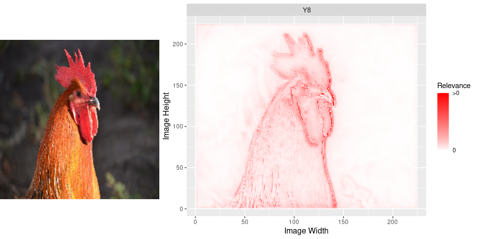

# `innsight` - Get the Insights of your Neural Network

<a href='https://bips-hb.github.io/innsight'></a>

<!-- badges: start -->

[](https://github.com/bips-hb/innsight/actions)
[](https://CRAN.R-project.org/package=innsight)
<!-- badges: end -->

`innsight` is an R package that interprets the behavior and explains
individual predictions of modern neural networks. Many methods for
explaining individual predictions already exist, but hardly any of them
are implemented or available in R. Most of these so-called *‘Feature
Attribution’* methods are only implemented in Python and thus difficult
to access or use for the R community. In this sense, the package
`innsight` provides a common interface for various methods for the
interpretability of neural networks and can therefore be considered as
an R analogue to
[iNNvestigate](https://github.com/albermax/innvestigate) for Python.

This package implements several model-specific interpretability (Feature
Attribution) methods based on neural networks in R, e.g.,

-   Layer-wise Relevance Propagation
    ([LRP](https://doi.org/10.1371/journal.pone.0130140))
    -   Including propagation rules: *ε*-rule and *α*-*β*-rule
-   Deep Learning Important Features
    ([DeepLift](https://arxiv.org/abs/1704.02685))
    -   Including propagation rules for non-linearities: rescale rule
        and reveal-cancel rule
-   Gradient-based methods:
    -   Vanilla Gradient, including [Gradient x
        Input](https://www.jmlr.org/papers/v11/baehrens10a.html)
    -   Smoothed gradients
        ([SmoothGrad](https://arxiv.org/abs/1706.03825)), including
        SmoothGrad x Input
-   Connection Weights

Example results for these methods on ImageNet with pretrained network
Vgg16:


The package `innsight` aims to be as flexible as possible and
independent of a specific deep learning package in which the passed
network has been learned. Basically, a neural network of the libraries
[`torch`](https://torch.mlverse.org/),
[`keras`](https://keras.rstudio.com/) and
[`neuralnet`](https://CRAN.R-project.org/package=neuralnet) can be
passed, which is internally converted into a
[`torch`](https://torch.mlverse.org/) model with special insights needed
for interpretation. Currently, the following model and layer types are
accepted:

-   `torch::nn_sequential` with layers `nn_linear`, `nn_conv1d`,
    `nn_conv2d`, `nn_max_pool1d`, `nn_max_pool2d`, `nn_avg_pool1d`,
    `nn_avg_pool2d`, `nn_dropout`, `nn_flatten` (see [torch issue
    \#716](https://github.com/mlverse/torch/issues/716#issuecomment-946117545)
    and use `classname = "nn_flatten"`)
-   `keras::keras_model_sequential` or `keras::keras_model` with layers
    `layer_dense`, `layer_conv_1d`, `layer_conv_2d`,
    `layer_max_pooling_1d`, `layer_max_pooling_2d`,
    `layer_average_pooling_1d`, `layer_average_pooling_2d`,
    `layer_dropout`, `layer_flatten`

But it is also possible to pass an arbitrary net in form of a named list
(see
[vignette](https://bips-hb.github.io/innsight/articles/Custom_Model_Definition.html)
for details).

## Installation

The package can be installed directly from CRAN and the development
version from GitHub with the following commands (successful installation
of [`devtools`](https://www.r-project.org/nosvn/pandoc/devtools.html) is
required)

``` r
# Stable version
install.packages("innsight")

# Development version
devtools::install_github("bips-hb/innsight")
```

Internally, any passed model is converted to a `torch` model, thus the
correct functionality of this package relies on a complete and correct
installation of `torch`. For this reason, the following command must be
run manually to install the missing libraries LibTorch and LibLantern:

``` r
torch::install_torch()
```

**Note:** Currently this can lead to problems under Windows if the
Visual Studio runtime is not pre-installed. See the issue on GitHub
[here](https://github.com/mlverse/torch/issues/246#issuecomment-695097121)
or for more information and other problems with installing `torch` see
the official installation
[vignette](https://CRAN.R-project.org/package=torch/vignettes/installation.html)
of `torch`.

## Usage

You have a trained neural network `model` on your model input data
`data`. Now you want to interpret individual datapoints or the overall
behavior by using the methods from the package `innsight`, then stick to
the following pseudo code:

``` r
# --------------- Train your model -----------------
# 'model' has to be an instance of either torch::nn_sequential, 
# keras::keras_model_sequential, keras::keras_model or neuralnet::neuralnet
model = ...

# -------------- Convert your model ----------------
# For keras and neuralnet
converter <- Converter$new(model)
# For a torch model the argument 'input_dim' is required
converter <- Converter$new(model, input_dim = model_input_dim)

# ----------------- Apply method -------------------
# Apply global method
result <- Method$new(converter) # no data argument is needed
# Plot the result
plot(result)

# Apply local methods
result <- Method$new(converter, data)
# Plot individual results
plot(result)
# Plot a boxplot of all given data points in argument 'data' 
boxplot(result)
```

## Examples

### 1. Iris-Dataset

<details>
<summary>
Train a neural network in torch on the iris-dataset
</summary>

``` r
library(innsight)
library(torch)
data(iris)

# Prepare Data
x <- torch_tensor(as.matrix(iris[, -5]))
y <- torch_tensor(as.integer(iris[, 5]))

# Define Model
model <- nn_sequential(
  nn_linear(4, 15), 
  nn_relu(),
  nn_dropout(0.3), 
  nn_linear(15, 10), 
  nn_relu(),
  nn_dropout(0.3), 
  nn_linear(10, 5), 
  nn_relu(),
  nn_linear(5, 3), 
  nn_softmax(2)
)

# Train model
optimizer <- optim_adam(model$parameters, lr = 0.0002)
for (t in 1:2500) {
  y_pred <- torch_log(model(x))
  loss <- nnf_nll_loss(y_pred, y)
  if (t %% 250 == 0) {
    cat("Loss: ", as.numeric(loss), "\n")
  }
  optimizer$zero_grad()
  loss$backward()
  optimizer$step()
}
#> Loss:  1.034311 
#> Loss:  0.8588966 
#> Loss:  0.6706114 
#> Loss:  0.5762339 
#> Loss:  0.5493336 
#> Loss:  0.5144928 
#> Loss:  0.4707141 
#> Loss:  0.3532465 
#> Loss:  0.2839047 
#> Loss:  0.2687521
```

</details>

``` r
# create a Converter for this model
converter <- Converter$new(model, input_dim = c(4),
                           input_names = list(names(iris[,-5])),
                           output_names = list(levels(iris[,5])))

# Apply local method LRP with epsilon rule
lrp_eps <- LRP$new(converter, iris[,-5], rule_name = "epsilon")

# Plot the individual result for two datapoints and all classes
p1 <- plot(lrp_eps, data_idx = c(1,102), output_idx = 1:3) +
  ggplot2::labs(title = "LRP ('epsilon')")

# Plot the boxplot statistic for all datapoints and all classes
# without a preprocess function
p2 <- boxplot(lrp_eps, output_idx = 1:3, ref_data_idx = 1, preprocess_FUN = identity) 

gridExtra::grid.arrange(p1,p2, ncol = 1, layout_matrix = matrix(c(1,1,1,2,2), ncol = 1))
```


### 2. Pretrained VGG16 on ImageNet

``` r
library(keras)

# Load image
image <- image_load("man/images/imagenet_rooster.png", target_size = c(224,224))
image <- image_to_array(image)
p_image <- grid::rasterGrob(image / 255)

# Preprocess image
x <- array_reshape(image, c(1, dim(image)))
x <- imagenet_preprocess_input(x)

# Get pretrained Vgg16
model <- application_vgg16()

# Convert the model
converter <- Converter$new(model)

# Apply LRP with rule 'alpha_beta' with alpha = 1
lrp_ab <- LRP$new(converter, x, 
                  output_idx = c(8), # 8 is index for class 'cock'
                  rule_name = "alpha_beta",
                  rule_param = 1,
                  channels_first = FALSE) 

# We have to flip the y axis before plotting
lrp_ab$result <- torch::torch_flip(lrp_ab$result, c(2))
p_lrp_ab <- plot(lrp_ab)

gridExtra::grid.arrange(p_image, p_lrp_ab, layout_matrix = matrix(c(1,2,2), nrow = 1))
```



## Funding

This work is funded by the German Research Foundation (DFG) in the
context of the Emmy Noether Grant 437611051.
