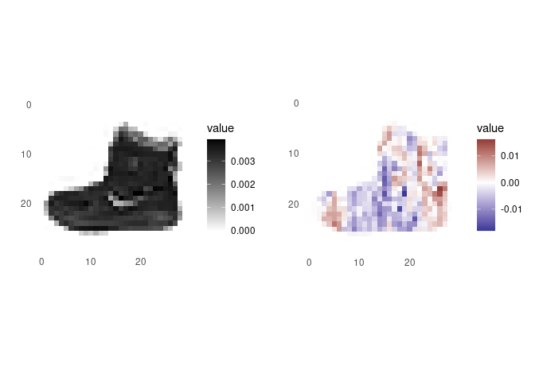

# innsight - Get the insights of your Neural Network

<!-- badges: start -->
<!-- badges: end -->

`innsight` is an R package that interprets the behavior and explains
predictions of machine learning models. It implements several
model-specific interpretability methods based on Neural Networks in R,
e.g.,

-   Layer-wise Relevance Propagation
    ([LRP](https://journals.plos.org/plosone/article?id=10.1371/journal.pone.0130140))
-   Deep Learning Important Features
    ([DeepLift](https://arxiv.org/abs/1704.02685))
-   Gradient-based methods:
    -   Vanilla Gradient, including [Gradient x
        Input](https://www.jmlr.org/papers/v11/baehrens10a.html)
    -   Smoothed gradients
        ([SmoothGrad](https://arxiv.org/abs/1706.03825))
-   Connection Weights

Basically, a Neural Network of the libraries
[`torch`](https://torch.mlverse.org/),
[`keras`](https://keras.rstudio.com/) and
[`neuralnet`](https://cran.r-project.org/web/packages/neuralnet/) can be
passed, which is internally converted into a torch model with special
insights needed for interpretation.

## Installation

Install `devtools` and `torch` from CRAN. Than run the following
commands:

    #> Lade nötiges Paket: usethis

``` r
devtools::install_github("bips-hb/innsight")
library(innsight)
```

## Examples

### 1. Neuralnet (Simple)

Let’s train a simple fully connected Neural Network with the package
`neuralnet` on the iris dataset:

``` r
library(innsight)
library(neuralnet)
data(iris)

nn <- neuralnet( Species ~ .,
                 iris, linear.output = FALSE,
                 hidden = c(10,8), act.fct = "tanh", threshold = 0.5)
# create an analyzer for this model
analyzer = Analyzer$new(nn)

# Apply method Connection_Weights
cw <- Connection_Weights$new(analyzer)
cw$get_result()
#>           [,1]        [,2]       [,3]
#> [1,] 10.648673  -5.1405835 -12.034988
#> [2,]  3.351498  -0.4607685  -6.666609
#> [3,]  7.010789 -11.8235960   6.530646
#> [4,]  3.565123  -6.9573231   4.517111
```

### 2. keras (advanced)

``` r
library(keras)

fashion_mnist <- dataset_fashion_mnist()
c(train_images, train_labels) %<-% fashion_mnist$train
c(test_images, test_labels) %<-% fashion_mnist$test


train_images <- train_images / 255
test_images <- train_images[1:100,,] / 255
dim(train_images) <- c(60000, 28, 28, 1)
dim(test_images) <- c(100, 28, 28, 1)

model <- keras_model_sequential()
model %>%
  layer_conv_2d(filters = 8, kernel_size = c(4,4), input_shape = c(28,28, 1), activation = 'relu') %>%
  layer_conv_2d(filters = 4, kernel_size = c(2,2), activation = 'relu') %>%
  layer_flatten() %>%
  layer_dropout(0.25) %>%
  layer_dense(units = 128, activation = 'relu') %>%
  layer_dense(units = 10, activation = 'softmax')

model %>% compile(
  optimizer = 'adam', 
  loss = 'sparse_categorical_crossentropy',
  metrics = c('accuracy')
)

model %>% fit(train_images, train_labels, epochs = 10, verbose = 2)

analyzer <- Analyzer$new(model)
#> Skipping Dropout-Layer...

lrp <- LRP$new(analyzer, test_images, channels_first = FALSE)
result <- lrp$get_result()
```


