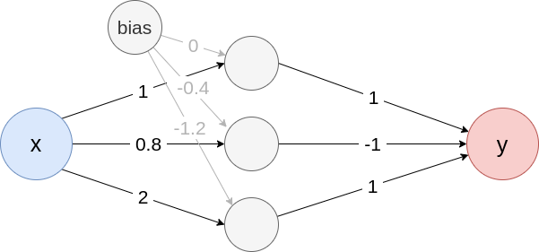
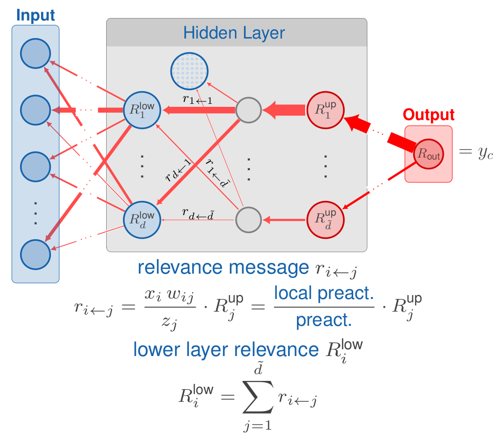

```{r, include = FALSE}
knitr::opts_chunk$set(
  fig.dpi = ifelse(Sys.getenv("RENDER_PLOTLY", unset = 0) == 1, 400, 50),
  collapse = TRUE,
  eval = torch::torch_is_installed(),
  comment = "#>",
  fig.align = "center",
  out.width = "90%"
)

library(innsight)
```

```{css, echo = FALSE, eval = TRUE}
details {
  padding: 10px 10px;
}

details > summary {
  border: none;
  cursor: pointer;
}

details[open] {
  border-radius: 10px 10px 10px 10px;
  padding: 7px 7px;
  border: 3px solid lightgrey;
}
```

```{=html}
<style>
.column-left{
  float: left;
  width: 60%;
  text-align: left;
}
.column-right{
  float: right;
  width: 40%;
  text-align: right;
}
</style>
```

> **`r knitr::asis_output("\U1F4DD")`  Note**  
> Since the **innsight** package relies on the **torch** package for each method 
and this requires a successful installation of LibTorch and other dependencies 
(`torch::install_torch()`), no examples can be run in the R vignette for 
memory reasons. For the executed code chunks, we refer to [our website](https://bips-hb.github.io/innsight/articles/detailed_overview.html).

As described in the [introduction](https://bips-hb.github.io/innsight/articles/innsight.html), 
**innsight** is a package that aims to
be highly flexible and easily accessible to almost any R user from any
background. This vignette describes in detail all the possibilities to
explain a prediction of a data instance for a given model using the provided 
methods and how to create a visualization of the results.

# Step 1: The `Converter`

The R6 class `Converter` is the heart of the package and makes it to a
*deep-learning-model-agnostic* approach, i.e., it accepts models not
only from a single deep learning library but from many different
libraries. This property makes the package outstanding and highly
flexible. Internally, each layer is analyzed, and the relevant parameters
and components are extracted into a list. Afterward, a customized 
model based on the library **torch** is generated from this list, with the 
interpretation methods pre-implemented in each of the accepted layers and
modules. On this baseline, different methods can be implemented and applied 
later in step 2. To be able to create a new object, the following
call is used:

```{r, eval = FALSE}
converter <- Converter$new(model,
  input_dim = NULL,
  input_names = NULL,
  output_names = NULL,
  dtype = "float",
  save_model_as_list = FALSE
)
```

As you can see, the `Converter` class is implemented using an `R6::R6Class()` 
class. However, this assumes that users have prior knowledge of these classes, 
potentially making the application a bit unfamiliar. For this reason, we 
have implemented a shortcut function that initializes an object of the 
`Converter` class in a more familiar R syntax:

```{r, eval = FALSE}
converter <- convert(model,
  input_dim = NULL,
  input_names = NULL,
  output_names = NULL,
  dtype = "float",
  save_model_as_list = FALSE
)
```

## Argument `model`

This is the passed trained model. Currently, it can be a sequential
[**torch**](https://torch.mlverse.org/) model (`nn_sequential()`), a 
[**tensorflow/keras**](https://tensorflow.rstudio.com/) model (`keras_model()` or
`keras_model_sequential()`), a **neuralnet** model or a model as a list. All
these options are explained in detail in the following subsections.

### Package torch

Currently, only models created by [`torch::nn_sequential`](https://torch.mlverse.org/docs/reference/nn_sequential.html) are accepted.
However, the most popular standard layers and activation functions are
available:

-   Linear layers: `nn_linear()`

-   Convolutional layers: `nn_conv1d()`, `nn_conv2d()` (but only with
    `padding_mode = "zeros"` and numerical padding)
    
-   Max-pooling layers: `nn_max_pool1d()`, `nn_max_pool2d()` (both only with
    default arguments for `padding = 0`, `dilation = 1`,
    `return_indices = FALSE` and `ceil_mode = FALSE`)
    
-   Average-pooling layers: `nn_avg_pool1d()`, `nn_avg_pool2d()` (both only
    with default arguments for `padding = 0`, `return_indices = FALSE`
    and `ceil_mode = FALSE`)
    
-   Batch-normalization layers: `nn_batch_norm1d()`, `nn_batch_norm2d()`

-   Flatten layer: `nn_flatten()` 

-   Skipped layers: `nn_dropout()` 

-   Activation functions: `nn_relu`, `nn_leaky_relu`, `nn_softplus`, 
    `nn_sigmoid`, `nn_softmax`, `nn_tanh` (open an issue if you need any more)

> **`r knitr::asis_output("\U1F4DD")`  Notes**  
>
>   In a **torch** model, the shape of the inputs is not stored; hence it
    must be specified with the argument `input_dim` within the
    initialization of the `Converter` object.

<details>

<summary>**Example: Convert a torch model**</summary>

```{r}
library(torch)

torch_model <- nn_sequential(
  nn_conv2d(3, 5, c(2, 2), stride = 2, padding = 3),
  nn_relu(),
  nn_avg_pool2d(c(2, 2)),
  nn_flatten(),
  nn_linear(80, 32),
  nn_relu(),
  nn_dropout(),
  nn_linear(32, 2),
  nn_softmax(dim = 2)
)

# For torch models the optional argument `input_dim` becomes a necessary one
converter <- convert(torch_model, input_dim = c(3, 10, 10))
```

</details>

### Package keras {#package-keras}

**Keras** models created by [`keras_model_sequential`](https://tensorflow.rstudio.com/reference/keras/keras_model_sequential)
or [`keras_model`](https://tensorflow.rstudio.com/reference/keras/keras_model) are
accepted. Within these functions, the following layers are allowed to be
used:

-   Input layer: `layer_input()`

-   Linear layers: `layer_dense()`

-   Convolutional layers: `layer_conv_1d()`, `layer_conv_2d()`

-   Pooling layers: `layer_max_pooling_1d()`, `layer_max_pooling_2d()`,
    `layer_average_pooling_1d()`, `layer_average_pooling_2d()`,
    `layer_global_average_pooling_1d()`, `layer_global_average_pooling_2d()`,
    `layer_global_max_pooling_1d()`, `layer_global_max_pooling_2d()`

-   Batch-normalization layer: `layer_batch_normalization()`

-   Flatten layer: `layer_flatten()`

-   Merging layers: `layer_add()`, `layer_concatenate()` (but it is assumed
    that the concatenation axis points to the channel axis)
    
-   Padding layers: `layer_zero_padding_1d()`, `layer_zero_padding_2d()`

-   Skipped layers: `layer_dropout()`

-   Activation functions: The following activation functions are allowed
    as character argument (`activation`) in a linear and convolutional
    layer: `"relu"`, `"softplus"`, `"sigmoid"`, `"softmax"`, `"tanh"`,
    `"linear"`. But you can also specify the activation function as a
    standalone layer: `layer_activation_relu()`,
    `layer_activation_softmax()`. But keep in mind that an activation
    layer may only follow a dense, convolutional or pooling layer. If you 
    miss an activation function, feel free to open an issue on GitHub.

<details>

<summary>**Examples: Convert a keras model**</summary>

**Example 1: `keras_model_sequential`**

```{r, eval = torch::torch_is_installed() & keras::is_keras_available()}
library(keras)

# Create model
keras_model_seq <- keras_model_sequential()
keras_model_seq <- keras_model_seq %>%
  layer_dense(10, input_shape = c(5), activation = "softplus") %>%
  layer_dense(8, use_bias = FALSE, activation = "tanh") %>%
  layer_dropout(0.2) %>%
  layer_dense(4, activation = "softmax")

converter <- convert(keras_model_seq)
```

**Example 2: `keras_model`**

```{r, eval = torch::torch_is_installed() & keras::is_keras_available()}
library(keras)

input_image <- layer_input(shape = c(10, 10, 3))
input_tab <- layer_input(shape = c(20))

conv_part <- input_image %>%
  layer_conv_2d(5, c(2, 2), activation = "relu", padding = "same") %>%
  layer_average_pooling_2d() %>%
  layer_conv_2d(4, c(2, 2)) %>%
  layer_activation(activation = "softplus") %>%
  layer_flatten()

output <- layer_concatenate(list(conv_part, input_tab)) %>%
  layer_dense(50, activation = "relu") %>%
  layer_dropout(0.3) %>%
  layer_dense(3, activation = "softmax")

keras_model_concat <- keras_model(inputs = list(input_image, input_tab), outputs = output)

converter <- convert(keras_model_concat)
```

</details>

### Package neuralnet

Using nets from the package **neuralnet** is very simple and
straightforward, because the package offers much fewer options than
**torch** or **keras**. The only thing to note is that no custom activation
function can be used. However, the package saves the names of the inputs
and outputs, which can, of course, be overwritten with the arguments
`input_names` and `output_names` when creating the converter object.

<details>

<summary>**Example: Convert a neuralnet model**</summary>

```{r}
library(neuralnet)
data(iris)
set.seed(42)

# Create model
neuralnet_model <- neuralnet(Species ~ Petal.Length + Petal.Width, iris,
  linear.output = FALSE
)

# Convert model
converter <- convert(neuralnet_model)
# Show input names
converter$input_names
# Show output names
converter$output_names
```

</details>

### Model as named list {#model-as-named-list}

Besides models from the packages **keras**, **torch** and **neuralnet** it is
also possible to pass a self-defined model in the form of a named list to
the `Converter` class/`convert()` function. This enables the interpretation 
of networks from other libraries with all available methods provided by 
the **innsight** package.

If you want to create a custom model, your list (e.g., `model <- list()`)
needs at least the keys `model$input_dim` and `model$layers`. However,
other optional keys that can be used to name the input
features and output nodes or to test the model for correctness. In
summary:

<ul>

<li>

**`input_dim`**\
The model input dimension excluding the batch dimension in the format
*"channels first"*. If there is only one input layer, it can be specified
as a vector. Otherwise, use a list of the shapes of the individual input
layers in the correct order.

<details>

<summary>Examples</summary>

1.  one dense input layer with five features:

```{r, eval = FALSE}
model$input_dim <- c(5)
```

2.  two input layers consisting of one dense layer of shape $10$ and one
    convolutional layer of shape $10\times10\times3$:

```{r, eval = FALSE}
input_dim <- list(c(10), c(3, 10, 10)) # channels have to be first!
```
</details>
<br>
</li>

<li>**`input_nodes`**\
An integer vector specifying the indices of the input layers from the
`layers` list. If there are multiple input layers, the indices of the
corresponding layers must be in the same order as in the `input_dim` and
`input_names` arguments. If this argument is not set, a warning is
printed and it is assumed that the first layer in `layers` is the only
input layer.<br> <br></li>

<li>

**`input_names`** (optional)\
The names for each input dimension excluding the batch axis in the
format *"channels first"*. If there is only one input layer, it can be
specified as a list of character vectors or factors for each input axis.
Otherwise, use a list of those for each input layer in the correct order.

<details>

<summary>Examples</summary>

1.  one dense layer with two features:

```{r, eval = FALSE}
model$input_names <- c("Feature_1", "Feature_2")
```

2.  one convolutional layer with shape $3\times 3\times 2$:

```{r, eval = FALSE}
model$input_names <- list(c("C1", "C2"), c("H1", "H2"), c("W1", "W2"))
```

3.  two input layers consisting of one dense layer of shape $2$ and one
    convolutional layer of shape $3\times3\times2$:

```{r, eval = FALSE}
model$input_names <- list(
  list(c("Feature_1", "Feature_2")),
  list(c("C1", "C2"), c("H1", "H2"), c("W1", "W2"))
)
```

</details>

</li>

</ul>

-   **`output_dim`** (optional)\
    An integer vector or a list of vectors with the model output
    dimension without the batch dimension analogous to `input_dim`. This
    value does not need to be specified and will be calculated
    otherwise. However, if it is set, the calculated value will be
    compared with it to avoid errors while converting the model.

-   **`output_nodes`**\
    An integer vector specifying the indices of the output layers from
    the `layers` list. If there are multiple output layers, the indices
    of the corresponding layers must be in the same order as in the
    `output_dim` and `output_names` arguments. If this argument is not
    set, a warning is printed and it is assumed that the last layer in
    `layers` is the only output layer.<br> <br>

-   **`output_names`** (optional)\
    A list or a list of lists with the names for each output dimension
    for each output layer analogous to `input_names`. By default
    (`NULL`), the names are generated.

-   **`layers`**\
    (see next subsection)

> **`r knitr::asis_output("\U1F4DD")`  Notes**  
The arguments for the input and output names are optional. By default
(`NULL`), they are generated, i.e.,
>
> -   the output names are `c("Y1", "Y2", "Y3", ... )` for each output layer.
  -   the input names are  
>
>      *   `c("X1", "X2", "X3", ...)` for tabular input layers,  
>      *   `list(c("C1", "C2", ...), c("L1", "L2", ...))` for 1D input layers and  
>      *   `list(c("C1", "C2", ...), c("H1", "H2", ...), c("W1", "W2", ...))`
      for 2D input layers.

#### Adding layers to your list-model

The list entry `layers` contains a list with all accepted layers of the
model. In general, each element has the following three arguments:

-   **`type`:** The type of the layer, e.g., `"Dense"`, `"Conv2D"`,
    `"MaxPooling1D"`, etc. (see blow for all accepted types).

-   **`input_layers`:** The list indices from the `layers` list going
    into this layer, i.e., the previous layers. If this argument is not
    set, a warning is printed and it is assumed that the previous list
    index in `layers` is the only preceding layer. If this layer is an input layer,
    use the value `0`.

-   **`output_layers`:** The list indices from the `layers` list that
    follow this layer. If this argument is not set, a warning is printed
    and it is assumed that the next list index in `layers` is the only
    following layer. If this layer is an output layer, use the value `-1`.

-   **`dim_in`** (optional): The input dimension of this layer excluding
    the batch axis according to the format

    <ul>

    <li>$\left( \text{feat}_\text{in} \right)$ for tabular data, e.g., `c(3)` for $3$
    features,</li>

    <li>$\left(\text{channels}_\text{in}, \text{length}_\text{in} \right)$
    for 1D signal data, e.g., `c(3,10)` for signals with length $10$ and $3$ 
    channels or</li>

    <li>$\left(\text{channels}_\text{in}, \text{height}_\text{in}, \text{width}_\text{in} \right)$
    for 2D image data, e.g., `c(3,10,10)` for images of shape $10\times10$ with $3$
    channels.</li>

    <li>For merging layers, a list of the above formats is required,
    but this is described in more detail in the corresponding types
    below.</li>

    </ul>

    This value is not necessary, but helpful to check the format of the
    weight matrix and the overall correctness of the converted model.

-   **`dim_out`** (optional): The output dimension of this layer
    excluding the batch axis analogous to the argument `dim_in`. This
    value is not necessary, but helpful to check the format of the
    weight matrix and the overall correctness of the converted model.

In addition to these main arguments, individual arguments can be set for
each layer type, as described below:

<details>

<summary>**Dense layer (`type = "Dense"`)**</summary>

-   **`weight`**: The weight matrix of the dense layer with shape
    (`dim_out`, `dim_in`).

-   **`bias`**: The bias vector of the dense layer with length
    `dim_out`.

-   **`activation_name`**: The name of the activation function for this
    dense layer, e.g., `'linear'`, `'relu'`, `'tanh'` or `'softmax'`.

**Example for a dense layer**

```{r}
# Define dense layer
dense_layer <- list(
  type = "Dense",
  input_layers = 0, # '0' means input layer
  output_layers = 2,
  weight = matrix(rnorm(5 * 2), 2, 5),
  bias = rnorm(2),
  activation_name = "tanh",
  dim_in = 5, # optional
  dim_out = 2 # optional
)
```

</details>

<details>

<summary>**Convolutional layer (`type = "Con1D"` or
`"Con2D"`)**</summary>

-   **`weight`**: The weight array of the convolutional layer with shape
    $\left(\text{channels}_\text{out}, \text{channels}_\text{in}, \text{kernel}_\text{length}\right)$ 
    for 1D signal or $\left(\text{channels}_\text{out}, \text{channels}_\text{in}, \text{kernel}_\text{height}, \text{kernel}_\text{width}\right)$ for 2D image.

-   **`bias`**: The bias vector of the layer with length $\text{channels}_\text{out}$.

-   **`activation_name`**: The name of the activation function for this
    layer, e.g., `'linear'`, `'relu'`, `'tanh'` or `'softmax'`.

-   **`stride`** (optional): The stride of the convolution (single
    integer for 1D and tuple of two integers for 2D data). If this value is
    not specified, the default values (1D: `1` and 2D: `c(1,1)`) are
    used.

-   **`padding`** (optional): Zero-padding added to the sides of the
    input before convolution. For 1D-convolution a tuple of the form
    $\left(\text{pad}_\text{left}, \text{pad}_\text{right}\right)$ and for 
    2D-convolution $\left(\text{pad}_\text{left}, \text{pad}_\text{right}, \text{pad}_\text{top}, \text{pad}_\text{bottom}\right)$ is required. If this value is not
    specified, the default values (1D: `c(0,0)` and 2D: `c(0,0,0,0)`)
    are used.

-   **`dilation`** (optional): Spacing between kernel elements (single
    integer for 1D and tuple of two integers for 2D data). If this value is
    not specified, the default values (1D: `1` and 2D: `c(1,1)`) are
    used.

**Examples for convolutional layers**

```{r, eval = FALSE}
# 1D convolutional layer
conv_1D <- list(
  type = "Conv1D",
  input_layers = 1,
  output_layers = 3,
  weight = array(rnorm(8 * 3 * 2), dim = c(8, 3, 2)),
  bias = rnorm(8),
  padding = c(2, 1),
  activation_name = "tanh",
  dim_in = c(3, 10), # optional
  dim_out = c(8, 9) # optional
)

# 2D convolutional layer
conv_2D <- list(
  type = "Conv2D",
  input_layes = 3,
  output_layers = 5,
  weight = array(rnorm(8 * 3 * 2 * 4), dim = c(8, 3, 2, 4)),
  bias = rnorm(8),
  padding = c(1, 1, 0, 0),
  dilation = c(1, 2),
  activation_name = "relu",
  dim_in = c(3, 10, 10) # optional
)
```

</details>

<details>

<summary>**Pooling layer (`type = "MaxPooling1D"`, `"MaxPooling2D"`,
`"AveragePooling1D"` or `"AveragePooling2D"`)**</summary>

-   **`kernel_size`**: The size of the pooling window as an integer
    value for 1D-pooling and an tuple of two integers for 2D-pooling.

-   **`strides`** (optional): The stride of the pooling window (single
    integer for 1D and tuple of two integers for 2D data). If this value is
    not specified (`NULL`), the value of `kernel_size` will be used.

**Example for a pooling layer**

```{r, eval = FALSE}
# 2D average pooling layer
avg_pool2D <- list(
  type = "AveragePooling2D",
  input_layers = 1,
  output_layers = 3,
  kernel_size = c(2, 2)
)
```

</details>

<details>


<summary>**Batch-Normalization layer (`type = "BatchNorm"`)**</summary>

During inference, the layer normalizes its output using a moving average 
of the mean and standard deviation of the batches it has seen during training,
i.e.,
$$
y = \gamma \cdot \frac{x - \mu}{\sqrt{\sigma + \varepsilon}} + \beta
$$

-   **`num_features`**: The number of features to normalize over. 
    Usually the number of channels is used.
    
-   **`eps`**: The value $\varepsilon$ added to the denominator for numerical 
    stability.
    
-   **`gamma`**: The vector of scaling factors $\gamma$ for each feature to be 
    normalized, i.e., a numerical vector of length `num_features`.
    
-   **`beta`**: The vector of offset values $\beta$ for each feature to be 
    normalized, i.e., a numerical vector of length `num_features`.
    
-   **`run_mean`**: The vector of running means $\mu$ for each feature to be
    normalized, i.e., a numerical vector of length `num_features`.
    
-   **`run_var`**: The vector of running variances $\sigma$ for each feature 
    to be normalized, i.e., a numerical vector of length `num_features`.

**Example for a batch normalization layer**

```{r, eval = FALSE}
# batch normalization layer
batchnorm <- list(
  type = "BatchNorm",
  input_layers = 1,
  output_layers = 3,
  num_features = 3,
  eps = 1e-4,
  gamma = c(1.1, 0.0, -0.3),
  beta = c(1, -3, -1.4),
  run_mean = c(-1.9, 3, 2.3),
  run_var = c(1, 2.1, 3.5)
)
```

</details>

<details>

<summary>**Flatten layer (`type = "Flatten"`)**</summary>

-   **`start_dim`** (optional): An integer value that describes the axis
    from which the dimension is flattened. By default (`NULL`) the axis
    following the batch axis is selected, i.e., `2`.

-   **`end_dim`** (optional): An integer value that describes the axis
    to which the dimension is flattened. By default (`NULL`) the last
    axis is selected, i.e., `-1`.

**Example for a flatten layer**

```{r, eval = FALSE}
# flatten layer
flatten <- list(
  type = "Flatten",
  input_layers = 1,
  output_layers = 3,
  start_dim = 2, # optional
  end_dim = 4, # optional
  dim_in = c(3, 10, 10), # optional
  out_dim = c(300) # optional
)
```

</details>

<details>

<summary>**Global pooling layer (`type = "GlobalPooling"`)**</summary>

-   **`method`:** Use either `'average'` for global average pooling or 
    `'max'` for global maximum pooling.

**Examples for global pooling layers**

```{r, eval = FALSE}
# global MaxPooling layer
global_max_pool2D <- list(
  type = "GlobalPooling",
  input_layers = 1,
  output_layers = 3,
  method = "max",
  dim_in = c(3, 10, 10), # optional
  out_dim = c(3) # optional
)

# global AvgPooling layer
global_avg_pool1D <- list(
  type = "GlobalPooling",
  input_layers = 1,
  output_layers = 3,
  method = "average",
  dim_in = c(3, 10), # optional
  out_dim = c(3) # optional
)
```

</details>

<details>


<summary>**Padding layer (`type = "Padding"`)**</summary>

-   **`padding`:** This integer vector specifies the number of padded 
    elements, but its length depends on the input size:
    * length of 2 for 1D signal data: $\left(\text{pad}_\text{left}, \text{pad}_\text{right}\right)$
    * length of 4 for 2D image data: $\left(\text{pad}_\text{left}, \text{pad}_\text{right}, \text{pad}_\text{top}, \text{pad}_\text{bottom} \right)$.
    
-   **`mode`:** The padding mode. Use either `'constant'` (default), 
    `'reflect'`, `'replicate'` or `'circular'`.
    
-   **`value`:** The fill value for `'constant'` padding.

**Example for a padding layer**

```{r, eval = FALSE}
# padding layer
padding <- list(
  type = "Padding",
  input_layers = 1,
  output_layers = 3,
  padding = c(2, 4),
  mode = "constant",
  value = 1,
  dim_in = c(3, 10), # optional
  out_dim = c(3, 16) # optional
)
```

</details>

<details>

<summary>**Concatenation layer (`type = "Concatenate"`)**</summary>

-   **`dim`:** An integer value that describes the axis over which the
    inputs are concatenated.

> **`r knitr::asis_output("\U1F4DD")`  Note**  
For this layer the argument `dim_in` is a list of input
dimensions.

**Example for a concatenation layer**

```{r, eval = FALSE}
# concatenation layer
concat <- list(
  type = "Concatenation",
  input_layers = c(1, 3),
  output_layers = 5,
  dim = 2,
  dim_in = list(c(5), c(3)), # optional
  out_dim = c(8) # optional
)
```

</details>

<details>

<summary>**Adding layer (`type = "Add"`)**</summary>

> **`r knitr::asis_output("\U1F4DD")`  Note**  
For this layer the argument `dim_in` is a list of input
dimensions.

**Example for an adding layer**

```{r, eval = FALSE}
# adding layer
add <- list(
  type = "Add",
  input_layers = c(1, 3),
  output_layers = 5,
  dim_in = list(c(3, 10, 10), c(3, 10, 10)), # optional
  out_dim = c(3, 10, 10) # optional
)
```

</details>

## Argument `input_dim`

With the argument `input_dim`, input size excluding the batch
dimension is passed. For many packages, this information is already
included in the given `model`. In this case, this argument only acts as
a check and throws an error in case of inconsistency. However, if the
input size is not included in the model, which is, for example, the case
for models from the package **torch**, it becomes a necessary argument and
the correct size must be passed. All in all, four different forms of
input shapes are accepted, whereby all shapes with channels must always
be in the *"channels first"* format for internal reasons:

-   **Tabular inputs:** If the model has no channels and is only
    one-dimensional, the input size can be passed as a single integer or
    vector with a single integer, e.g., a dense layer with five features
    would have an input shape of `5` or `c(5)`.

-   **Signal inputs:** If the model has signals consisting of a channel
    and another dimension as input, the input size can be passed as a
    vector composed of the number of channels $C$ and the
    signal length $L$ in the channels first format, i.e.,
    $\left(C, L\right)$. For example, for a 1D
    convolutional layer with three channels and a signal length of $10$
    (both formats $3 \times 10$ and $10 \times 3$), the shape `c(3, 10)`
    must be passed.

-   **Image inputs:** If the model has images consisting of a channel
    and two other dimensions as input, the input size can be passed as a
    vector composed of the number of channels $C$, the
    image height $H$ and width $W$ in the channels
    first format, i.e., $\left(C, H, W\right)$. For
    example, for a 2D convolutional layer with three channels, image
    height of $32$ and width of $20$ (both formats
    $3 \times 32 \times 20$ and $32 \times 20 \times 3$), the shape
    `c(3, 32, 20)` must be passed.

<ul>
<li>
**Multiple inputs:** If the passed model has multiple input layers,
they can be passed in the correct layer-order in a list of the
shapes from above. For example, for a model with an input layer with
five features and another input layer with images of size
$32\times32\times3$, the list `list(c(5), c(3, 32, 32))` must be
passed.  

> **`r knitr::asis_output("\U1F4DD")`  Note**  
With multiple input layers, it is required that the original
ordering of the input layers of the passed model matches the
ordering in `input_dim` and also the ordering of the input names in
the `input_names` argument.

</li>
</ul>

## Argument `input_names`

According to the shapes from the argument [`input_dim`](#argument-input_dim),
the input names for each layer and dimension can be passed with the optional
argument `input_names`. This means that for each integer in `input_dim` a vector
of this length is passed with the labels, which is then summarized for all
dimensions in a list. The labels can be provided both as normal character
vectors and as factors and they will be used for the visualizations in Step 3.
Factors can be used to specify the order of the labels as they will be
visualized later in [Step 3](#step-3-show-and-plot-the-results). For the 
individual input formats, the input names
can be passes as described below:

-   **Tabular inputs:** If, for example, `input_dim = c(4)`, a possible
    value for the input names can be
    ```{r, eval = FALSE}
    list(c("set", "your", "labels", "here!"))
    # or as a factor
    list(
      factor(c("set", "your", "labels", "here"),
        levels = c("labels", "set", "your", "here")
      )
    )
    ```

-   **Signal inputs:** If, for example, `input_dim = c(3, 6)`, a possible
    value for the input names can be
    ```{r, eval = FALSE}
    list(
      c("channels", "are", "first"),
      c("Length1", "Length2", "Length3", "Length4", "Length5", "Length6")
    )
    ```

-   **Image inputs:** If, for example, `input_dim = c(3, 4, 4)`, a
    possible value for the input names can be
    ```{r, eval = FALSE}
    list(
      c("channels", "are", "first"),
      c("then", "comes", "the", "image height"),
      c("and", "then", "the", "width")
    )
    ```

-   **Multiple inputs:** If, for example,
    `input_dim = list(c(4), c(3, 4, 4))`, a possible value for the input
    names can be

    ```{r, eval = FALSE}
    list(
      # first input layer
      list(c("Feat_1", "Feat_2", "Feat_3", "Feat_4")),
      # second input layer
      list(
        c("C1", "C2", "C3"),
        c("Height_1", "Height_2", "Height_3", "Height_4"),
        c("W1", "W2", "W3", "W4")
      )
    )
    ```

> **`r knitr::asis_output("\U1F4DD")`  Notes**  
> The argument for the input names is optional. By default (`NULL`) they
are generated, i.e., the input names are
>
> -   `list(c("X1", "X2", "X3", ...))` for tabular input layers
> -   `list(c("C1", "C2", ...), c("L1", "L2", ...))` for 1D input layers
> -   `list(c("C1", "C2", ...), c("H1", "H2", ...), c("W1", "W2", ...))`
    for 2D input layers.

## Argument `output_names`

The optional argument `output_names` can be used to define the names of
the outputs for each output layer analog to `input_names` for the
inputs. During the initialization of the `Converter` instance, the
output size is calculated and stored in the field `output_dim`, which is
structured in the same way as the argument `input_dim`. This results in
the structure of the argument `output_names` analogous to the argument
`input_names`, i.e., a vector of labels, a factor or, in case of several output
layers, a list of label vectors or factors. For example, for an output layer with
three nodes, the following list of labels can be passed:

```{r, eval = FALSE}
c("First output node", "second one", "last output node")
# or as a factor
factor(c("First output node", "second one", "last output node"),
  levels = c("last output node", "First output node", "second one", )
)
```

For a model with two output layers (two nodes in the first and four in
the second), the following input would be valid:

```{r, eval = FALSE}
list(
  c("Yes", "No!"),
  c("Out1", "Out2", "Out3", "Out4")
)
```

Since it is an optional argument, the labels `c("Y1", "Y2", "Y3", ...)`
are generated with the default value `NULL` for each output layer.

## Other arguments

### Argument `dtype` {#argument-dtype}

This argument defines the numerical floating-point number's precision with which
all internal calculations are performed. Accepted are currently 32-bit
floating point (`"float"` the default value) and 64-bit floating point numbers
(`"double"`). All weights, constants and inputs are then converted accordingly
into the data format `torch_float()` or `torch_double()`.

> **`r knitr::asis_output("\U1F4DD")`  Note**  
At this point, this decision is especially crucial
for exact comparisons, and if the precision is too inaccurate, errors
could occur. See the following example:

<details>

<summary>Example</summary>

We create two random $10 \times 10$ matrices $A$ and $B$:

```{r}
torch_manual_seed(123)
A <- torch_randn(10, 10)
B <- torch_randn(10, 10)
```

Now it can happen that the results of functions like `torch_mm` and a
manual calculation differ:

```{r}
# result of first row and first column after matrix multiplication
res1 <- torch_mm(A, B)[1, 1]
# calculation by hand
res2 <- sum(A[1, ] * B[, 1])

# difference:
res1 - res2
```

This is an expected behavior, which is explained in detail in the
PyTorch documentation
[here](https://pytorch.org/docs/stable/notes/numerical_accuracy.html#batched-computations-or-slice-computations).
But you can reduce the error by using the double precision with
`torch_double()`:

```{r}
torch_manual_seed(123)
A <- torch_randn(10, 10, dtype = torch_double())
B <- torch_randn(10, 10, dtype = torch_double())

# result of first row and first column after matrix multiplication
res1 <- torch_mm(A, B)[1, 1]
# calculation by hand
res2 <- sum(A[1, ] * B[, 1])

# difference:
res1 - res2
```

</details>

### Argument `save_model_as_list` {#argument-save_model_as_list}

As already described in the [introduction vignette](https://bips-hb.github.io/innsight/articles/innsight.html), a
given model is first converted to a list and then the **torch** model is
created from it. By default, however, this list is not stored in the
`Converter` object, since this requires a lot of memory for large models
and is otherwise not used further. With the logical argument
`save_model_as_list`, this list can be stored in the field
`model_as_list` for further investigations. For example, this list can
again be used as a model for a new `Converter` instance.

## Fields

After an instance of the `Converter` class has been successfully
created, the most important arguments and results are stored in the
fields of the R6 object. The existing fields are explained briefly in
the following:

-   `model`: This field contains the **torch**-converted model based on
    the module `ConvertedModel` (see `?ConvertedModel` for more
    information) containing the model with pre-implemented feature
    attribution methods.
    
-   `input_dim`: This field is more or less a copy of the argument
    `input_dim` of the `Converter` object, only unified that it is 
    always a list of the input shapes for each input layer, i.e., 
    the argument `input_dim = c(4)` turns into `list(c(4))`.
    
-   `input_names`: Analog to the field `input_dim`, the field
    `input_names` contains the input labels of the `Converter` 
    argument `input_names`, but as a list of the label lists for each input
    layer, i.e., the argument
    `input_names = list(c("C1", "C2"), c("A", "B"))` turns into
    `list(list(c("C1", "C2"), c("A", "B")))`.
    
-   `output_dim`: This field contains a list of the calculated output
    shapes of each output layer.
    
-   `output_names`: Analog to the field `input_names` but for the
    argument `output_names`.
    
-   `model_as_list`: The given model converted to a list (see [argument
    `save_model_as_list`](#argument-save_model_as_list) for more
    information).

<details>

<summary>Examples: Accessing and working with fields</summary>

Let's consider again the model from Example 2 in the [**keras**
section](#package-keras) (make sure that the model `keras_model_concat`
is loaded!):

```{r}
# Convert the model and save the model as a list
converter <- convert(keras_model_concat, save_model_as_list = TRUE)

# Get the field `input_dim`
converter$input_dim
```

As you can see, the model has two input layers. The first one is for
images of shape $3 \times 10 \times 10$ and the second layer for dense
inputs of shape $20$. For example, we can now examine whether the
converted model provides the same output as the original model:

```{r}
# create input in the format "channels last"
x <- list(
  array(rnorm(3 * 10 * 10), dim = c(1, 10, 10, 3)),
  array(rnorm(20), dim = c(1, 20))
)

# output of the original model
y_true <- as.array(keras_model_concat(x))
# output of the torch-converted model (the data 'x' is in the format channels
# last, hence we need to set the argument 'channels_first = FALSE')
y <- as.array(converter$model(x, channels_first = FALSE)[[1]])

# mean squared error
mean((y - y_true)**2)
```

Since we did not pass any arguments for the input and output names, they
were generated and stored in the list format in the `input_names` and
`output_names` fields. Remember that in these fields, regardless of the
number of input or output layers, there is always an outer list for the 
layers and then inner lists for the layer's dimensions.

```{r}
# get the calculated output dimension
str(converter$output_dim)
# get the generated output names (one layer with three output nodes)
str(converter$output_names)
# get the generated input names
str(converter$input_names)
```

Since we have set the `save_model_as_list` argument to `TRUE`, we can
now get the model as a list, which has the structure described in the
section [Model as named list](#model-as-named-list). This list can now
be modified as you wish and it can also be used again as a model for a
new `Converter` instance.

```{r}
# get the mode as a list
model_as_list <- converter$model_as_list
# print the fourth layer
str(model_as_list$layers[[4]])
# let's change the activation function to "relu"
model_as_list$layers[[4]]$activation_name <- "relu"
# create a Converter object with the modified model
converter_modified <- convert(model_as_list)

# now, we get different results for the same input because of the relu activation
converter_modified$model(x, channels_first = FALSE)
converter$model(x, channels_first = FALSE)
```

</details>

In addition, the default `print()` function for R6 classes has been 
overwritten so that all important properties, fields and contents of the 
converter object can be displayed in a summarized form:

```{r, echo=FALSE}
options(width = 90)
```
```{r}
# print the Converter instance
converter
```


# Step 2: Apply selected method

The **innsight** package provides the most popular feature attribution
methods in a unified framework. Besides the individual method-specific
variations, the overall structure of each method is nevertheless the
same. This structure with the most important arguments is shown in the
following and internally realized by the super class `InterpretingMethod`
(see `?InterpretingMethod` for more information), whereby the
method-specific arguments are explained further below with the
respective methods realized as inherited R6 classes. The basic call of a 
method looks like this:

```{r, eval = FALSE}
# Apply the selected method
method <- Method$new(converter, data,
  channels_first = TRUE,
  output_idx = NULL,
  output_label = NULL,
  ignore_last_act = TRUE,
  verbose = interactive(),
  dtype = "float"
)
```

In this case as well, all methods are implemented as R6 classes. However, 
here we have also implemented helper functions for initialization, allowing 
the application of a method through a simple method call instead of `$new()`. 
These methods all start with the prefix `run_` and end with the corresponding 
acronym for the method (e.g., `run_grad()`).

## Arguments

### Argument `converter`

The `Converter` object from the [first step](#step-1-the-converter) is one of 
the crucial elements for the application of a selected method because it 
converted the original model into a **torch** structure necessary for 
**innsight** in which the methods are pre-implemented in each layer.

### Argument `data`

In addition to the converter object, the input data is also essential as
it will be analyzed and explained using the methods provided at the end.
Accepted are data as:

-   Base R data types like `matrix`, `array`, `data.frame` or other
    array-like formats of size 
    $\left(\text{batch_size}, \text{input_dim}\right)$. These formats can
    be used mainly when the model has only one input layer. Internally,
    the data is converted to an array using the `as.array` function and
    stored as a `torch_tensor` in the given `dtype` afterward.
    
-   `torch_tensor`: The converting process described in the last point
    can also be skipped by directly passing the data as a `torch_tensor`
    of size $\left(\text{batch_size}, \text{input_dim}\right)$.
    
-   `list`: You can also pass a list with the corresponding input data
    according to the upper points for each input layer.

> **`r knitr::asis_output("\U1F4DD")`  Note**  
The argument data is a necessary argument only for the local
interpretation methods. Otherwise, it is unnecessary, e.g., the global
variant of the [Connection Weights](#connection-weights) method can be used 
without data.

### Argument `channels_first`

This argument tells the package where the channel axis for images and
signals is located in the input data. Internally, all calculations are
performed with the channels in the second position after the batch
dimension (*"channels first"*), e.g., `c(10,3,32,32)` for a batch of ten
images with three channels and a height and width of $32$ pixels. Thus
input data in the format *"channels last"* (i.e., `c(10,32,32,3)` for the
previous example) must be transformed accordingly. If the given `data`
has no channel axis, use the default value `TRUE`.

### Argument `output_idx`

These indices specify the model's output nodes for which the method is
to be applied. For the sake of models with multiple output layers, the
method object gives the following possibilities to select the indices of
the output nodes in the individual output layers:

-   A vector of indices: If the model has only one output layer, the
    values correspond to the indices of the output nodes, e.g.,
    `c(1,3,4)` for the first, third and fourth output node. If there are
    multiple output layers, the indices of the output nodes from the
    first output layer are considered.
    
-   A list of index vectors: If the method is to be applied to output
    nodes from different layers, a list can be passed that specifies the
    desired indices of the output nodes for each output layer. Unwanted
    output layers have the entry `NULL` instead of a vector of indices,
    e.g., `list(NULL, c(1,3))` for the first and third output node in the
    second output layer.
    
-   `NULL` (default): The method is applied to all output nodes in the
    first output layer but is limited to the first ten as the
    calculations become more computationally expensive for more output
    nodes.

### Argument `output_label`

These values specify the output nodes for which the method is to be applied and
can be used as an alternative to the argument `output_idx`. 
Only values that were previously passed with the argument `output_names` in 
the `converter` can be used. In order to allow models with multiple output 
layers, there are the following possibilities to select the names of 
the output nodes in the individual output layers:

-   A `character` vector or `factor` of labels: If the model has only one output
    layer, the values correspond to the labels of the output nodes named in the
    passed `Converter` object, e.g.,
    `c("a", "c", "d")` for the first, third and fourth output node if the
    output names are `c("a", "b", "c", "d")`. If there are
    multiple output layers, the names of the output nodes from the first
    output layer are considered.
    
-   A `list` of `charactor`/`factor` vectors of labels: If the method is to be
    applied to output nodes from different layers, a list can be passed
    that specifies the desired labels of the output nodes for each
    output layer. Unwanted output layers have the entry `NULL` instead of
    a vector of labels, e.g., `list(NULL, c("a", "c"))` for the first and
    third output node in the second output layer.
  
-   `NULL` (default): The method is applied to all output nodes in
    the first output layer but is limited to the first ten as the
    calculations become more computationally expensive for more output
    nodes.

### Argument `ignore_last_act`

Set this logical value to include the last activation function for each
output layer, or not (default: `TRUE`). In practice, the last activation
(especially for softmax activation) is often omitted.

### Argument `dtype`

This argument defines the numerical precision with which all internal
calculations are performed. Accepted are currently 32-bit floating
point (`"float"` the default value) and 64-bit floating point numbers
(`"double"`). All weights, constants and inputs are then converted
accordingly into the data format `torch_float()` or `torch_double()`. See
the [argument `dtype`](#argument-dtype) in the `Converter` object for
more details.

## Methods

As described earlier, all implemented methods inherit from the
`InterpretingMethod` super class. But each method has method-specific
arguments and different objectives. To make them a bit more
understandable, they are all explained with the help of the following
simple example model with ReLU activation in the first, hyperbolic
tangent in the last layer and only one in- and output node:

```{r, eval = TRUE, echo=FALSE, fig.cap = "**Fig. 1:** Example neural network", out.width = "80%"}

```

<details>

<summary>Create the model from Fig. 1</summary>

```{r}
model <- list(
  input_dim = 1,
  input_nodes = 1,
  input_names = c("x"),
  output_nodes = 2,
  output_names = c("y"),
  layers = list(
    list(
      type = "Dense",
      input_layers = 0,
      output_layers = 2,
      weight = matrix(c(1, 0.8, 2), nrow = 3),
      bias = c(0, -0.4, -1.2),
      activation_name = "relu"
    ),
    list(
      type = "Dense",
      input_layers = 1,
      output_layers = -1,
      weight = matrix(c(1, -1, 1), nrow = 1),
      bias = c(0),
      activation_name = "tanh"
    )
  )
)

converter <- convert(model)
```

</details>

### Vanilla Gradient {#method-vanilla-gradient}

One of the first and most intuitive methods for interpreting neural
networks is the *Gradients* method introduced by [Simonyan et al. (2013)](https://arxiv.org/abs/1312.6034),
also known as *Vanilla Gradients* or *Saliency maps*. This method
computes the gradients of the selected output with respect to the input
variables. Therefore the resulting relevance values indicate 
prediction-sensitive variables, i.e., those
variables that can be locally perturbed the least to change the outcome
the most. Mathematically, this method can be described by the following
formula for the input variable $x_i$ with $x \in \mathbb{R}^n$, the
model $f:\mathbb{R}^n \to \mathbb{R}^C$ and the output $y_c = f(x)_c$ of class
$c$: 
$$
\text{Gradient}(x)_i^c = \frac{\partial\ f(x)_c}{\partial\ x_i} = \frac{\partial\ y_c}{\partial\ x_i}
$$

As described in the introduction of this section, the corresponding 
**innsight**-method `Gradient` inherits from the super class 
`InterpretingMethod`, meaning that we need
to change the term `Method` to `Gradient`. Alternatively, an object of the 
class `Gradient` can also be created using the mentioned helper function 
`run_grad()`, which does not require prior knowledge of R6 objects. 
The only model-specific
argument is `times_input`, which can be used to switch between the two
methods *Gradient* (default `FALSE`) and *Gradient$\times$Input* (`TRUE`). For more
information on the method *Gradient$\times$Input* see [this
subsection](#gradienttimesinput-and-smoothgradtimesinput).

```{r, eval = FALSE}
# R6 class syntax
grad <- Gradient$new(converter, data,
  times_input = FALSE,
  ... # other arguments inherited from 'InterpretingMethod'
)

# Using the helper function 
grad <- run_grad(converter, data,
  times_input = FALSE,
  ... # other arguments inherited from 'InterpretingMethod'
)
```

<details>

<summary>Example with visualization</summary>

In this example, we want to describe the data point $x_1 = 0.45$ with
the Gradient method. In principle, the slope of the tangent in $x_1$ is
calculated and thus the local rate of change, which in this case is
$\tanh'(x_1) = \frac{1}{\cosh(x_1)^2} = 0.822$ (see the red line in Fig.
2). Assuming that the function behaves linearly overall, increasing $x$
by one raises the output by $0.822$. In general, however, neural
networks are highly nonlinear, so this interpretation is only valid for
very small changes of $x_1$ as you can see in Fig. 2.

```{r, echo = FALSE, fig.width=5, fig.height= 3, fig.cap= "**Fig. 2:** Gradient method"}
library(ggplot2)

func <- function(x) {
  as.array(converter$model(torch_tensor(matrix(x, ncol = 1)))[[1]])
}

grad_func <- function(x) {
  grad <- x
  grad <- ifelse(x <= 0, 0, grad)
  grad <- ifelse(x > 0 & x <= 0.5, 1 / cosh(x)**2, grad)
  grad <- ifelse(x > 0.5 & x <= 0.6, 0.2 / cosh(0.2 * x + 0.4)**2, grad)
  grad <- ifelse(x > 0.6, 2.2 / cosh(0.8 - 2.2 * x)**2, grad)

  grad
}

base <-
  ggplot() +
  xlim(-0.2, 1.3) +
  ylim(-0.2, 1) +
  xlab("x") +
  geom_vline(aes(xintercept = 0)) +
  geom_hline(aes(yintercept = 0)) +
  annotate("text", label = "f", x = 0.92, y = 0.95, size = 6)

base +
  geom_function(fun = func, alpha = 0.7) +
  geom_segment(aes(x = 0.45, y = -0.05, xend = 0.45, yend = 0.05), linewidth = 0.8) +
  geom_segment(aes(x = -0.03, y = tanh(0.45), xend = 0.03, yend = tanh(0.45)), 
               linewidth = 0.8) +
  annotate("text", label = "x[1]", x = 0.45, y = -0.12, size = 5, parse = TRUE) +
  annotate("text", label = "f(x[1])", x = -0.13, y = tanh(0.45), size = 5, parse = TRUE) +
  geom_segment(aes(
    x = 0.25, xend = 0.65, y = tanh(0.45) - 0.2 / cosh(0.45)**2,
    yend = tanh(0.45) + 0.2 / cosh(0.45)**2
  ),
  color = "red", alpha = 0.7, linewidth = 1.5
  ) +
  geom_point(
    data = data.frame(x = 0.45, y = tanh(0.45)),
    mapping = aes(x = x, y = y)
  )
```

With **innsight**, this method is applied as follows and we receive the same
result:


```{r}
data <- matrix(c(0.45), 1, 1)

# Apply method (but don't ignore last activation)
grad <- run_grad(converter, data, ignore_last_act = FALSE)
# get result
get_result(grad)
```

</details>

### SmoothGrad {#method-smoothgrad}

The *SmoothGrad* method, introduced by [Smilkov et al. (2017)](https://arxiv.org/abs/1706.03825), addresses a
significant problem of the basic Gradient method. As described in the
previous subsection, gradients locally assume a linear behavior, but
this is generally no longer the case for deep neural networks. These
have large fluctuations and abruptly change their gradients, making the
interpretations of the gradient worse and potentially misleading.
Smilkov et al. proposed that instead of calculating only the gradient in
$x$, compute the gradients of randomly perturbed copies of $x$ and
determine the mean gradient from that. To use the *SmoothGrad* method to
obtain relevance values for the individual components
$x_i \in \mathbb{R}$ of an instance $x \in \mathbb{R^n}$, we first
generate $K \in \mathbb{N}$ realizations of a multivariate Gaussian
distribution $p = \mathcal{N}(0, \sigma^2)$ describing the random
perturbations, i.e., $\varepsilon^1, \ldots, \varepsilon^K \sim p$. Then
the empirical mean of the gradients for variable $x_i$ and output index
$c$ can be calculated as follows:

$$
\text{SmoothGrad}(x)_i^c = \frac{1}{K} \sum_{j = 1}^K \frac{\partial\ f(x + \varepsilon^j)_c}{\partial\ x_i + \varepsilon_i^j}
\approx \mathbb{E}_{\varepsilon \sim p}\left[ \frac{\partial\ f(x + \varepsilon)_c}{\partial\ x_i + \varepsilon_i^j}\right]
$$

As described in the introduction of this section, the **innsight** method
`SmoothGrad` inherits from the super class `InterpretingMethod`, meaning
that we need to change the term `Method` to `SmoothGrad` or use the helper
function `run_smoothgrad()` for initializing an object of class `SmoothGrad`.
In addition, there are the following three model-specific arguments:

-   `n` (default: `50`): This integer value specifies how many
    perturbations will be used to calculate the mean gradient, i.e., the
    $K$ from the formula above. However, it must be noted that the
    computational effort increases by a factor of `n` compared to the
    Gradient method since the simple Gradient method is used `n` times
    instead of once. In return, the accuracy of the estimator increases
    with a larger `n`.

-   `noise_level` (default: `0.1`): With this argument, the strength of
    the spread of the Gaussian distribution can be given as a
    percentage, i.e., `noise_level` $=\frac{\sigma}{\max(x)-\min(x)}$.

-   `times_input` (default: `FALSE`): Similar to the `Gradient` method,
    this argument can be used to switch between the two methods
    SmoothGrad (`FALSE`) and *SmoothGrad$\times$Input* (`TRUE`). For more
    information on the method *SmoothGrad$\times$Input* see [this
    subsection](#gradienttimesinput-and-smoothgradtimesinput).

```{r, eval = FALSE}
# R6 class syntax
smoothgrad <- SmoothGrad$new(converter, data,
  n = 50,
  noise_level = 0.1,
  times_input = FALSE,
  ... # other arguments inherited from 'InterpretingMethod'
)

# Using the helper function 
smoothgrad <- run_smoothgrad(converter, data,
  n = 50,
  noise_level = 0.1,
  times_input = FALSE,
  ... # other arguments inherited from 'InterpretingMethod'
)
```

<details>

<summary>Example with visualization</summary>

We want to describe the data point $x_1 = 0.6$ with the method
*SmoothGrad*. As you can see in Figure 3, this point does not have a
unique gradient because it is something around $0.15$ from the left and
something around $1.66$ from the right. In such situations, SmoothGrad
comes in handy. As described before, the input $x_1$ is slightly
perturbed by a Gaussian distribution and then the mean gradient is
calculated. The individual gradients of the perturbed copies are
visualized in blue in Figure 3 with the red line representing the mean
gradient.

```{r, echo = FALSE, fig.width=5, fig.height= 3, fig.cap= "**Fig. 3:** SmoothGrad method"}
set.seed(111)
fig <- base +
  geom_function(fun = func, alpha = 0.7) +
  geom_segment(aes(x = 0.6, y = -0.05, xend = 0.6, yend = 0.05), linewidth = 0.8) +
  geom_segment(aes(x = -0.03, y = func(0.6), xend = 0.03, yend = func(0.6)), linewidth = 0.8) +
  annotate("text", label = "x[1]", x = 0.6, y = -0.12, size = 6, parse = TRUE) +
  annotate("text", label = "f(x[1])", x = -0.13, y = func(0.6), size = 6, parse = TRUE)

eps <- rnorm(10) * 0.2
x0 <- 0.6
y0 <- as.vector(func(x0))
x <- x0 + eps
y <- as.vector(func(x))
grad <- grad_func(x)
norm <- (1 + grad^2)**0.5
grad_mean <- mean(grad)
norm_mean <- (1 + grad_mean**2)**0.5


data <- data.frame(
  x = x - 0.4 / norm, xend = x + 0.4 / norm,
  y = y - grad * 0.4 / norm, yend = y + grad * 0.4 / norm
)
mean_grad <- data.frame(
  x = x0 - 0.6 / norm_mean, xend = x0 + 0.6 / norm_mean,
  y = y0 - grad_mean * 0.6 / norm_mean,
  yend = y0 + grad_mean * 0.6 / norm_mean
)

fig +
  geom_segment(
    data = data, mapping = aes(x = x, xend = xend, y = y, yend = yend),
    color = "darkblue", alpha = 0.3, linewidth = 0.5
  ) +
  geom_segment(
    data = mean_grad, mapping = aes(x = x, xend = xend, y = y, yend = yend),
    color = "red", alpha = 0.9, linewidth = 1.25
  ) +
  geom_function(fun = func, alpha = 0.7) +
  geom_point(mapping = aes(x = x, y = y), color = "blue", size = 0.8) +
  geom_point(
    data = data.frame(x = 0.6, y = func(0.6)),
    mapping = aes(x = x, y = y)
  )
```

With **innsight**, this method is applied as follows:

```{r}
data <- matrix(c(0.6), 1, 1)

# Apply method
smoothgrad <- run_smoothgrad(converter, data,
  noise_level = 0.2,
  n = 50,
  ignore_last_act = FALSE # include the tanh activation
) 
# get result
get_result(smoothgrad)
```

</details>

### Gradient$\times$Input and SmoothGrad$\times$Input

The methods *Gradient$\times$Input* and *SmoothGrad$\times$Input* are as simple
as they sound: the gradients are calculated as in the [gradient
section](#method-vanilla-gradient) and then multiplied by the respective input.
They were introduced by [Shrikumar et al.
(2016)](https://arxiv.org/abs/1605.01713) and have a well-grounded mathematical
background despite their simple idea. The basic idea is to decompose the output
according to its relevance to each input variable, i.e., we get variable-wise
additive effects

$$
\tag{1}
f(x)_c = \sum_{i = 1}^n R_i.
$$ 

Mathematically, this method is based on the first-order Taylor
decomposition. Assuming that the function $f$ is continuously
differentiable in $x \in \mathbb{R}^n$, a remainder term
$\varepsilon(f,z,x):\mathbb{R}^n \to \mathbb{R}$ with
$\lim_{z \to x} \varepsilon(f, z, x) = 0$ exists such that

$$
\begin{align}
f(z) &= f(x) + \nabla_x\ f(x)(z-x)^T + \varepsilon(f, z, x)\\
&= f(x) + \sum_{i = 1}^n \frac{\partial\ f(x)}{\partial\ x_i} (z_i - x_i) + \varepsilon(f, z, x), \quad z\in \mathbb{R}^n. \tag{2}
\end{align}
$$ 
The first-order Taylor formula thus describes a linear approximation
of the function $f$ at the point $x$ since only the first derivatives
are considered. Consequently, a highly nonlinear function $f$ is well
approximated in a small neighborhood around $x$. For larger
distances from $x$, sufficient small values of the residual term are not
guaranteed anymore. The *Gradient$\times$Input* method now considers the data
point $x$ and sets $z = 0$. In addition, the residual term and the
summand $f(0)_c$ are ignored, which then results in the following
approximation of $f(x)_c$ in variable-wise relevances

$$
f(x)_c \approx \sum_{i = 1}^n \frac{\partial\ f(x)_c}{\partial\ x_i} \cdot x_i, \quad \text{hence}\\
\text{Gradient$\times$Input}(x)_i^c = \frac{\partial\ f(x)_c}{\partial\ x_i} \cdot x_i.
$$

<details>

<summary>Derivation from Eq. 2</summary>

$$
\begin{align}
&f(z)_c = f(x)_c + \sum_{i = 1}^n \frac{\partial\ f(x)_c}{\partial\ x_i} (z_i - x_i) + \varepsilon(f, z, x)\\
\Leftrightarrow\quad & f(x)_c = f(z)_c - \sum_{i = 1}^n \frac{\partial\ f(x)_c}{\partial\ x_i} (z_i - x_i) - \varepsilon(f, z, x)\\
\Leftrightarrow\quad & f(x)_c = f(z)_c + \sum_{i = 1}^n \frac{\partial\ f(x)_c}{\partial\ x_i} (x_i - z_i) - \varepsilon(f, z, x)
\end{align}
$$ 
Hence, we get for $z = 0$ and after ignoring the remainder term and
the value $f(0)_c$ 
$$
\begin{align}
f(x)_c &= f(0)_c + \sum_{i = 1}^n \frac{\partial\ f(x)_c}{\partial\ x_i} x_i - \varepsilon(f, z, x) \tag{3}\\
&\approx \sum_{i = 1}^n \frac{\partial\ f(x)_c}{\partial\ x_i} x_i
\end{align}
$$


</details>

Analogously, this multiplication is also applied to the
[*SmoothGrad*](#method-smoothgrad) method in order to compensate for
local fluctuations: 
$$
\text{SmoothGrad$\times$Input}(x)_i^c = \frac{1}{K} \sum_{j = 1}^K \frac{\partial\ f(x + \varepsilon^j)_c}{\partial\ x_i + \varepsilon_i^j} \cdot (x_i + \varepsilon_i^j),\quad \varepsilon^1, \ldots, \varepsilon^K \sim \mathcal{N}(0,\sigma^2).
$$

Both methods are variants of the respective gradient methods `Gradient`
and `SmoothGrad` and also have the corresponding model-specific
arguments and helper functions for the initialization. These variants can 
be chosen with the argument `times_input`:

```{r, eval = FALSE}
# the "x Input" variant of method "Gradient"
grad_x_input <- Gradient$new(converter, data,
  times_input = TRUE,
  ... # other arguments of method "Gradient"
) 

# the same using the corresponding helper function
grad_x_input <- run_grad(converter, data,
  times_input = TRUE,
  ... # other arguments of method "Gradient"
) 

# the "x Input" variant of method "SmoothGrad"
smoothgrad_x_input <- SmoothGrad$new(converter, data,
  times_input = TRUE,
  ... # other arguments of method "SmoothGrad"
)

# the same using the corresponding helper function
smoothgrad_x_input <- run_smoothgrad(converter, data,
  times_input = TRUE,
  ... # other arguments of method "SmoothGrad"
)
```

<details>

<summary>Example with visualization</summary>

**Gradient$\times$Input:**  

Now let us describe the data point $x_1 = 0.49$ using the model defined
in this chapter's introduction. For this model holds the equation
$f(0) = 0$; therefore, the approximation error is only the negative
value of the remainder term at $0$ (as seen in Eq. 3). In Figure 4, the
Taylor approximation is drawn in red and at position $0$, you can also
see the value of the remainder term (because all other summands are
zero). At the same time, the red dot describes the result of the
*Gradient$\times$Input* method, which indeed deviates from the actual value
only by the negative of the remainder term at position $0$.

```{r, echo = FALSE, fig.width=5, fig.height= 3, fig.cap= "**Fig. 4:** Gradient$\\times$Input method"}
base +
  geom_function(fun = func, alpha = 0.7) +
  geom_segment(aes(xend = 0, yend = 0.5 * (c(func(0.49)) - grad_func(0.49) * 0.49), x = 0.75, y = 0.25), color = "black", linewidth = 0.25, arrow = arrow(length = unit(0.2, "cm"), type = "closed"), alpha = 0.8) +
  annotate("text", label = "ε(f,0.49,0)", x = 0.85, y = 0.25) +
  geom_segment(aes(x = 0.49, y = func(0.49), xend = 0.49, yend = grad_func(0.49) * 0.49), color = "red", linewidth = 0.3) +
  geom_segment(aes(x = 0, y = 0, xend = 0, yend = c(func(0.49)) - grad_func(0.49) * 0.49), color = "red", linewidth = 0.3) +
  geom_segment(aes(xend = 0.49, yend = c(func(0.49)) - 0.5 * (c(func(0.49)) - grad_func(0.49) * 0.49), x = 0.75, y = 0.25), color = "black", linewidth = 0.25, arrow = arrow(length = unit(0.2, "cm"), type = "closed"), alpha = 0.8) +
  geom_function(fun = function(x) grad_func(0.49) * (x - 0.49) + c(func(0.49)), color = "red", alpha = 0.7, xlim = c(-0.2, 1.1)) +
  geom_segment(aes(x = 0.49, y = -0.05, xend = 0.49, yend = 0.05), linewidth = 0.8) +
  geom_segment(aes(x = -0.03, y = func(0.49), xend = 0.03, yend = func(0.49)), linewidth = 0.8) +
  annotate("text", label = "x[1]", x = 0.49, y = -0.12, size = 6, parse = TRUE) +
  annotate("text", label = "f(x[1])", x = -0.13, y = func(0.49), size = 6, parse = TRUE) +
  geom_point(
    data = data.frame(x = 0.49, y = grad_func(0.49) * 0.49),
    mapping = aes(x = x, y = y), color = "red", alpha = 0.7
  ) +
  geom_point(
    data = data.frame(x = 0.49, y = func(0.49)),
    mapping = aes(x = x, y = y), color = "black", alpha = 0.7
  )
```

With **innsight**, this method is applied as follows:

```{r}
data <- matrix(c(0.49), 1, 1)

# Apply method
grad_x_input <- run_grad(converter, data,
  times_input = TRUE,
  ignore_last_act = FALSE # include the tanh activation
) 
# get result
get_result(grad_x_input)
```

**SmoothGrad$\times$Input:**  

It is also possible to use the *SmoothGrad$\times$Input* method to perturb the
input $x_1 = 0.49$ a bit and return an average value of the individual
*Gradient$\times$Input* results. Figure 5 shows the individual linear approximations of the
first-order Taylors for the Gaussian perturbed copies of $x_1$, and the blue
dots describe the respective Gradient$\times$Input values. The red dot represents the
mean value, i.e., the value of the *SmoothGrad$\times$Input* method at $x_1 = 0.49$.

```{r, echo = FALSE, fig.width=5, fig.height= 3, fig.cap= "**Fig. 5:** SmoothGrad$\\times$Input method"}
set.seed(111)

x <- 0.49 + rnorm(10) * 0.2
m <- grad_func(x)
b <- c(func(x)) - m * x

base +
  geom_function(fun = func, alpha = 0.7) +
  geom_segment(aes(x = 0.49, y = -0.05, xend = 0.49, yend = 0.05), linewidth = 0.8) +
  geom_segment(aes(x = -0.03, y = func(0.49), xend = 0.03, yend = func(0.49)), linewidth = 0.8) +
  annotate("text", label = "x[1]", x = 0.49, y = -0.12, size = 6, parse = TRUE) +
  annotate("text", label = "f(x[1])", x = -0.13, y = func(0.49), size = 6, parse = TRUE) +
  geom_function(fun = function(z) m[1] * z + b[1], color = "blue", alpha = 0.3, na.rm = TRUE, 
                linewidth = 0.3) +
  geom_function(fun = function(z) m[2] * z + b[2], color = "blue", alpha = 0.3, na.rm = TRUE, linewidth = 0.3) +
  geom_function(fun = function(z) m[3] * z + b[3], color = "blue", alpha = 0.3, na.rm = TRUE, linewidth = 0.3) +
  geom_function(fun = function(z) m[4] * z + b[4], color = "blue", alpha = 0.3, na.rm = TRUE, linewidth = 0.3) +
  geom_function(fun = function(z) m[5] * z + b[5], color = "blue", alpha = 0.3, na.rm = TRUE, linewidth = 0.3) +
  geom_function(fun = function(z) m[6] * z + b[6], color = "blue", alpha = 0.3, na.rm = TRUE, linewidth = 0.3) +
  geom_function(fun = function(z) m[7] * z + b[7], color = "blue", alpha = 0.3, na.rm = TRUE, linewidth = 0.3) +
  geom_function(fun = function(z) m[8] * z + b[8], color = "blue", alpha = 0.3, na.rm = TRUE, linewidth = 0.3) +
  geom_function(fun = function(z) m[9] * z + b[9], color = "blue", alpha = 0.3, na.rm = TRUE, linewidth = 0.3) +
  geom_function(fun = function(z) m[10] * z + b[10], color = "blue", alpha = 0.3, na.rm = TRUE, linewidth = 0.3) +
  geom_point(
    data = data.frame(x = x, y = func(x)), mapping = aes(x = x, y = y), color = "black",
    alpha = 0.3, size = 0.8
  ) +
  geom_point(
    data = data.frame(x = x, y = m * x), mapping = aes(x = x, y = y), color = "blue",
    alpha = 0.3
  ) +
  geom_point(data = data.frame(x = 0.49, y = mean(m * x)), mapping = aes(x = x, y = y), color = "red") +
  geom_point(
    data = data.frame(x = 0.49, y = func(0.49)),
    mapping = aes(x = x, y = y), color = "black", alpha = 0.7
  )
```

With **innsight**, this method is applied as follows:

```{r}
data <- matrix(c(0.49), 1, 1)

# Apply method
smoothgrad_x_input <- run_smoothgrad(converter, data,
  times_input = TRUE,
  ignore_last_act = FALSE # include the tanh activation
) 
# get result
get_result(smoothgrad_x_input)
```

</details>

### Layer-wise Relevance Propagation (LRP)

The *LRP* method was first introduced by [Bach et al. (2015)](https://journals.plos.org/plosone/article?id=10.1371/journal.pone.0130140) and has a
similar goal to the *Gradient$\times$Input* approach explained in the last
section: decompose the output into variable-wise relevances according to
Eq. 1. The difference is that the prediction $f(x)_c = y_c$ is
redistributed layer by layer from the output node back to the inputs
according to the weights and pre-activations. This is done by so-called
relevance messages $r_{i \leftarrow j}^{(l, l+1)}$, which can be defined
by a rule on redistributing the upper-layer relevance $R_j^{l +1}$ to
the lower-layer $R_i^{l}$. In the package **innsight**, the following
commonly used rules are defined ($i$ is an index of a node in layer
$l$ and $j$ an index of a node in layer $l+1$):

-   **The simple rule** (also known as *LRP-0*)\
    This is the most basic rule on which all other rules are more or
    less based. The relevances are redistributed to the lower layers
    according to the ratio between local and global pre-activation. Let
    $x_i$ the inputs, $w_{i,j}$ the weights and $b_j$ the bias vector of
    layer $l$ and $R_j^{(l+1)}$ the upper-layer relevance, then the
    simple rule is defined as 
    $$
    r_{i \leftarrow j}^{(l, l+1)} = \frac{x_i\, w_{i,j}}{z_j} \, R_j^{l +1}  \quad \text{with} \quad z_j = b_j + \sum_{k} x_k\, w_{k,j}.
    $$

-   **The $\varepsilon$-rule** (also known as *LRP-$\epsilon$*)\
    One problem with the simple rule is that it is numerically unstable
    when the global pre-activation $z_j$ vanishes and causes a division
    by zero. This problem is solved in the $\varepsilon$-rule by adding
    a stabilizer $\varepsilon > 0$ that moves the denominator away from
    zero, i.e., 
    $$
    r_{i \leftarrow j}^{(l, l+1)} = \frac{x_i\, w_{i,j}}{z_j + \text{sign}(z_j)\, \varepsilon}\, R_j^{l +1}.
    $$

-   **The $\alpha$-$\beta$-rule** (also known as *LRP-$\alpha \beta$*)\
    Another way to avoid this numerical instability is by treating the
    positive and negative pre-activations separately. In this case,
    positive and negative values cannot cancel each other out, i.e., a
    vanishing denominator also results in a vanishing numerator.
    Moreover, this rule allows choosing a weighting for the positive and
    negative relevances, which is done with the parameters
    $\alpha, \beta \in \mathbb{R}$ satisfying $\alpha + \beta = 1$. The
    $\alpha$-$\beta$-rule is defined as 
    $$
    r_{i \leftarrow j}^{(l, l+1)} = \left(\alpha \frac{(x_i\, w_{i,j})^+}{z_j^+} + \beta \frac{(x_i\, w_{i,j})^-}{z_j^-}\right)\, R_j^{l +1}\\
    \text{with}\quad z_j^\pm = (b_j)^\pm + \sum_k (x_k\, w_{k,j})^\pm,\quad (\cdot)^+ = \max(\cdot, 0),\quad
    (\cdot)^- = \min(\cdot, 0).
    $$

For any of the rules described above, the relevance of the lower-layer
nodes $R_i^{l}$ is determined by summing up all incoming relevance
messages $r_{i \leftarrow j}^{(l, l +1)}$ into the respective node of
index $i$, i.e., 
$$
R_i^{l} = \sum_j r_{i \leftarrow j}^{(l, l +1)}.
$$

::: column-left
This procedure is repeated layer by layer until one gets to the input
layer and consequently gets the relevances for each input variable. A
visual overview of the entire method using the simple rule as an example
is given in Fig. 6.

> **`r knitr::asis_output("\U1F4DD")`  Note**  
At this point, it must be mentioned that the LRP variants do not
lead to an exact decomposition of the output since some of the relevance
is absorbed by the bias terms. This is because the bias is included in
the pre-activation but does not appear in any of the numerators.

:::

::: column-right
```{r, eval = TRUE, echo=FALSE, fig.cap = "**Fig. 6:** Layerwise Relevance Propagation"}

```
:::

Analogous to the previous methods, the **innsight** method `LRP` inherits 
from the `InterpretingMetod` super class and thus all arguments. In addition,
there are the following method-specific arguments for this method:

-   `rule_name` (default: `"simple"`): This argument can be used to
    select the rule for the relevance messages. Implemented are the
    three rules described above, i.e., simple rule (`"simple"`),
    $\varepsilon$-rule (`"epsilon"`) and $\alpha$-$\beta$-rule
    (`"alpha_beta"`). However, a named list can also be passed to assign one of
    these three rules to each implemented layer type individually. Layers
    not specified in this list then use the default value `"simple"`. For
    example, with `list(Dense_Layer = "epsilon", Conv2D_Layer = "alpha_beta")`
    the simple rule is used for all dense layers and the $\alpha$-$\beta$-rule
    is applied to all 2D convolutional layers. The other layers not mentioned 
    use the default rule. In addition, for normalization layers like 
    `'BatchNorm_Layer'`, the rule `"pass"` is implemented as well, which 
    ignores such layers in the backward pass. You can set the rule for 
    the following layer types:
    
    * `'Dense_Layer'`, `'Conv1D_Layer'`, `'Conv2D_Layer'`, `'BatchNorm_Layer'`, 
    `'AvgPool1D_Layer'`, `'AvgPool2D_Layer'`, `'MaxPool1D_Layer'` and 
    `'MaxPool2D_Layer'`

-   `rule_param`: The meaning of this argument depends on the selected
    rule. For the simple rule, for example, it has no effect. In
    contrast, this numeric argument sets the value of $\varepsilon$ for
    the $\varepsilon$-rule and the value of $\alpha$ for the
    $\alpha$-$\beta$-rule (remember: $\beta = 1 - \alpha$). Passing
    `NULL` defaults to `0.01` for $\varepsilon$ or `0.5` for $\alpha$. Similar
    to the argument `rule_name`, this can also be a named list that individually 
    assigns a rule parameter to each layer type.
    
-   `winner_takes_all`: This logical argument is only relevant for models with 
    a MaxPooling layer. Since many zeros are produced during the backward pass 
    due to the selection of the maximum value in the pooling kernel, another 
    variant is implemented, which treats a MaxPooling as an AveragePooling 
    layer in the backward pass to overcome the problem of too many zero 
    relevances. With the default value `TRUE`, the whole upper-layer 
    relevance is passed to the maximum value in each pooling window. 
    Otherwise, if `FALSE`, the relevance is distributed equally among all 
    nodes in a pooling window.

```{r, eval = FALSE}
# R6 class syntax
lrp <- LRP$new(converter, data,
  rule_name = "simple",
  rule_param = NULL,
  winner_takes_all = TRUE,
  ... # other arguments inherited from 'InterpretingMethod'
) 

# Using the helper function for initialization
lrp <- run_lrp(converter, data,
  rule_name = "simple",
  rule_param = NULL,
  winner_takes_all = TRUE,
  ... # other arguments inherited from 'InterpretingMethod'
) 
```

<details>

<summary>Example</summary>

First, let's look again at the result at the point $x_1 = 0.49$, which
was about $0.3889$ when approximated with the *Gradient$\times$Input* method. For
LRP with the simple rule, we get $0.4542$ which exactly matches the
actual value of $f(x_1)$. This is mainly due to the fact that for an
input of $x_1$, only the top neuron from Fig. 1 is activated and it does
not have a bias term. However, if we now use an input that activates a
neuron with a bias term ($x_2 = 0.6$), there will be an approximation
error (for $x_2$ it's $-0.3675$) since it absorbs some of the relevance.
See the code below:

```{r}
# We can analyze multiple inputs simultaneously
data <- matrix(
  c(
    0.49, # only neuron without bias term is activated
    0.6   # neuron with bias term is activated
  ), 
  ncol = 1
)

# Apply LRP with simple rule
lrp <- run_lrp(converter, data,
  ignore_last_act = FALSE
)
get_result(lrp)

# get approximation error
matrix(lrp$get_result()) - as_array(converter$model(torch_tensor(data))[[1]])
```

The individual *LRP* variants can also be considered as a function in the
input variable $x$, which is shown in Fig. 7 with the true model $f$ in
black.

```{r, echo = FALSE, fig.width=7, fig.height= 4, fig.cap= "**Fig. 7:** LRP method", warning=FALSE, message=FALSE, results='hide'}


fun_1 <- function(x) {
  run_lrp(converter, matrix(x, ncol = 1), ignore_last_act = FALSE)$get_result()
}

fun_2 <- function(x) {
  run_lrp(converter, matrix(x, ncol = 1), ignore_last_act = FALSE, rule_name = "epsilon", rule_param = 0.1)$get_result()
}

fun_3 <- function(x) {
  run_lrp(converter, matrix(x, ncol = 1), ignore_last_act = FALSE, rule_name = "alpha_beta", rule_param = 0.5)$get_result()
}

fun_4 <- function(x) {
  run_lrp(converter, matrix(x, ncol = 1), ignore_last_act = FALSE, rule_name = "alpha_beta", rule_param = 1)$get_result()
}

ggplot() +
  xlim(-0.2, 1.3) +
  xlab("x") +
  geom_vline(aes(xintercept = 0)) +
  geom_hline(aes(yintercept = 0)) +
  geom_function(data = data.frame(label = "f"), mapping = aes(color = label), color = "black", fun = func, size = 2) +
  geom_function(data = data.frame(label = "simple"), mapping = aes(color = label), fun = fun_1) +
  geom_function(data = data.frame(label = "epsilon"), mapping = aes(color = label), fun = fun_2) +
  geom_function(data = data.frame(label = "alpha_beta (0.5)"), mapping = aes(color = label), fun = fun_3) +
  geom_function(data = data.frame(label = "alpha_beta (1)"), mapping = aes(color = label), fun = fun_4) +
  labs(color = "Rule")
```

</details>

### Deep Learning Important Features (DeepLift)

One method that, to some extent, echoes the idea of *LRP* is the so-called
*Deep Learning Important Features (DeepLift)* method introduced by
[Shrikumar et al.](https://dl.acm.org/doi/10.5555/3305890.3306006) in 2017. It
behaves similarly to *LRP* in a layer-by-layer backpropagation fashion from a
selected output node back to the input variables. However, it incorporates a
reference value $\tilde{x}$ to compare the relevances with each other. Hence,
the relevances of *DeepLift* represent the relative effect of the outputs of the
instance to be explained $f(x)_c$ and the output of the reference value
$f(\tilde{x})_c$, i.e., $f(x)_c - f(\tilde{x})_c$. This difference eliminates the
bias term in the relevance messages so that no more relevance is absorbed and we
have an exact variable-wise decomposition of $\Delta y = f(x)_c -
f(\tilde{x})_c$. In addition, the authors presented two rules to propagate
relevances through the activation part of the individual layers, namely
**Rescale** and **RevealCancel** rule. The Rescale rule simply scales the
contribution to the difference from reference output according to the value of
the activation function. The RevealCancel rule considers the average impact
after adding the negative or positive contribution revealing dependencies missed
by other approaches.

Analogous to the previous methods, the **innsight** method `DeepLift` inherits 
from the `InterpretingMetod` super class and thus all arguments. Alternatively, 
an object of the class `DeepLift` can also be created using the helper function 
`run_deeplift()`, which does not require prior knowledge of R6 objects. In 
addition, there are the following method-specific arguments for this method:

* `x_ref` (default: `NULL`): This argument describes the reference input
$\tilde{x}$ for the DeepLift method. This value must have the same format as
the input data of the passed model to the converter class, i.e.,

  * an `array`, `data.frame`, `torch_tensor` or array-like format of size
  $\left(1, \text{input_dim}\right)$ or
  * a `list` with the corresponding input data (according to the upper point)
  for each of the input layers.
  * It is also possible to use the default value `NULL` to take only zeros
  as reference input.

* `rule_name` (default: `'rescale'`): Name of the applied rule to calculate the 
contributions. Use either `'rescale'` or `'reveal_cancel'`.

* `winner_takes_all`: This logical argument is only relevant for MaxPooling 
layers and is otherwise ignored. With this layer type, it is possible that 
the position of the maximum values in the pooling kernel of the normal input 
$x$ and the reference input $\tilde{x}$ may not match, which leads to a 
violation of the summation-to-delta property. To overcome this problem, 
another variant is implemented, which treats a MaxPooling layer as an
AveragePooling layer in the backward pass only, leading to a uniform 
distribution of the upper-layer contribution to the lower layer.


```{r, eval = FALSE}
# R6 class syntax
deeplift <- DeepLift$new(converter, data,
  x_ref = NULL,
  rule_name = "rescale",
  winner_takes_all = TRUE,
  ... # other arguments inherited from 'InterpretingMethod'
) 

# Using the helper function for initialization
deeplift <- run_deeplift(converter, data,
  x_ref = NULL,
  rule_name = "rescale",
  winner_takes_all = TRUE,
  ... # other arguments inherited from 'InterpretingMethod'
) 
```

<details>
<summary> Examples </summary>
In this example, let's consider the point $x = 0.55$ and the reference point 
$\tilde{x} = 0.1$. With the help of the model defined previously, the 
respective outputs are $y = f(x) = 0.4699$ and $\tilde{y} = f(\tilde{x}) = 0.0997$.
The DeepLift method now generates an exact variable-wise decomposition of the 
so-called difference-from-reference value $\Delta y = y - \tilde{y} = 0.3702772$.
Since there is only one input feature in this case, the entire value should be 
assigned to it:
```{r}
# Create data
x <- matrix(c(0.55))
x_ref <- matrix(c(0.1))

# Apply method DeepLift with rescale rule
deeplift <- run_deeplift(converter, x, x_ref = x_ref, ignore_last_act = FALSE)

# Get result
get_result(deeplift)
```
This example is an extremely simple model, so we will test this method on a 
slightly larger model and the Iris dataset (see `?iris`):
```{r}
library(neuralnet)
set.seed(42)

# Crate model with package 'neuralnet'
model <- neuralnet(Species ~ ., iris, hidden = 5, linear.output = FALSE)

# Step 1: Create 'Converter'
conv <- convert(model)

# Step 2: Apply DeepLift (reveal-cancel rule)
x_ref <- matrix(colMeans(iris[, -5]), nrow = 1) # use colmeans as reference value
deeplift <- run_deeplift(conv, iris[, -5],
  x_ref = x_ref, ignore_last_act = FALSE,
  rule_name = "reveal_cancel"
)

# Verify exact decomposition
y <- predict(model, iris[, -5])
y_ref <- predict(model, x_ref[rep(1, 150), ])
delta_y <- y - y_ref
summed_decomposition <- apply(get_result(deeplift), c(1, 3), FUN = sum) # dim 2 is the input feature dim

# Show the mean squared error
mean((delta_y - summed_decomposition)^2)
```

</details>


### Integrated Gradients

In the *Integrated Gradients* method introduced by 
[Sundararajan et al. (2017)](https://arxiv.org/abs/1703.01365), the gradients 
are integrated along a path from the value $x$ to a reference value $\tilde{x}$. 
This integration results, similar to DeepLift, in a decomposition of $f(x) - f(\tilde{x})$. In 
this sense, the method uncovers the feature-wise relative effect of the 
input features on the difference between the prediction $f(x)$ and the 
reference prediction $f(\tilde{x})$. This is archived through the following
formula:
$$
\text{IntGrad}(x)_i^c = (x - \tilde{x}) \int_{\alpha = 0}^1 \frac{\partial f(\tilde{x} + \alpha (x - \tilde{x}))}{\partial x} d\alpha
$$
In simpler terms, it calculates how much each feature contributes to a model's 
output by tracing a path from a baseline input $\tilde{x}$ to the actual input 
$x$ and measuring the average gradients along that path.

Similar to the other gradient-based methods, by default the integrated 
gradient is multiplied by the input to get an approximate decomposition of 
$f(x) - f(\tilde{x})$. However, with the parameter `times_input` only the 
gradient describing the output sensitivity can be returned.

Analogous to the previous methods, the **innsight** method `IntegratedGradient` 
inherits from the `InterpretingMetod` super class and thus all arguments. 
Alternatively, an object of the class `IntegratedGradient` can also be created 
using the helper function `run_intgrad()`, which does not require prior 
knowledge of R6 objects. In addition, there are the following method-specific 
arguments for this method:

* `x_ref` (default: `NULL`): This argument describes the reference input
$\tilde{x}$ for the Integrated Gradients method. This value must have the same 
format as the input data of the passed model to the converter class, i.e.,

  * an `array`, `data.frame`, `torch_tensor` or array-like format of size
  $\left(1, \text{input_dim}\right)$ or
  * a `list` with the corresponding input data (according to the upper point)
  for each of the input layers.
  * It is also possible to use the default value `NULL` to take only zeros
  as reference input.
  
* `n` (default: `50`): Number of steps for the approximation of the 
integration path along $\alpha$.
  
* `times_input` (default: `TRUE`): Multiplies the integrated gradients with 
the difference of the input features and the baseline values. By default, the
original definition of Integrated Gradient is applied. However, by setting 
`times_input = FALSE` only an approximation of the integral is calculated, 
which describes the sensitivity of the features to the output.


```{r, eval = FALSE}
# R6 class syntax
intgrad <- IntegratedGradient$new(converter, data,
  x_ref = NULL,
  n = 50,
  times_input = TRUE,
  ... # other arguments inherited from 'InterpretingMethod'
) 

# Using the helper function for initialization
intgrad <- run_intgrad(converter, data,
  x_ref = NULL,
  n = 50,
  times_input = TRUE,
  ... # other arguments inherited from 'InterpretingMethod'
) 
```

<details>
<summary> Examples </summary>
In this example, let's consider the point $x = 0.55$ and the reference point 
$\tilde{x} = 0.1$. With the help of the model defined previously, the 
respective outputs are $y = f(x) = 0.4699$ and $\tilde{y} = f(\tilde{x}) = 0.0997$.
The Integrated Gradient method now generates an approximate variable-wise 
decomposition of the so-called difference-from-reference value 
$\Delta y = y - \tilde{y} = 0.3702772$.
Since there is only one input feature in this case, the entire value should be 
assigned to it:
```{r}
# Create data
x <- matrix(c(0.55))
x_ref <- matrix(c(0.1))

# Apply method IntegratedGradient
intgrad <- run_intgrad(converter, x, x_ref = x_ref, ignore_last_act = FALSE)

# Get result
get_result(intgrad)
```

</details>


### Expected Gradients

The *Expected Gradients* method ([Erion et al., 2021](https://doi.org/10.1038/s42256-021-00343-w)), 
also known as *GradSHAP*, 
is a local feature attribution technique which extends the Integrated Gradient 
method and provides approximate Shapley values. In contrast to Integrated 
Gradient, it considers not only a single reference value $\tilde{x}$ but the 
whole distribution of reference values $\tilde{X} \sim \tilde{x}$ and averages 
the Integrated Gradient values over this distribution. Mathematically, the 
method can be described as follows:
$$
\text{ExpGrad}(x)_i^c = \mathbb{E}_{\tilde{x}\sim \tilde{X}, \alpha \sim U(0,1)} \left[(x - \tilde{x}) \times \frac{\partial f(\tilde{x} + \alpha (x - \tilde{x}))}{\partial x} \right]
$$
These feature-wise values approximate a decomposition of the prediction minus
the average prediction in the reference dataset, i.e., 
$f(x) - \mathbb{E}_{\tilde{x}}\left[f(\tilde{x}) \right]$. This means, it
solves the issue of choosing the right reference value.

Analogous to the previous methods, the **innsight** method `ExpectedGradient` 
inherits from the `InterpretingMetod` super class and thus all arguments. 
Alternatively, an object of the class `ExpectedGradient` can also be created 
using the helper function `run_expgrad()`, which does not require prior 
knowledge of R6 objects. In addition, there are the following method-specific 
arguments for this method:

* `data_ref` (default: `NULL`): This argument describes the reference inputs
$\tilde{x}$ for the Expected Gradients method. This value must have the same 
format as the input data of the passed model to the converter class, i.e.,

  * an `array`, `data.frame`, `torch_tensor` or array-like format of size
  $\left(1, \text{input_dim}\right)$ or
  * a `list` with the corresponding input data (according to the upper point)
  for each of the input layers.
  * It is also possible to use the default value `NULL` to take only zeros
  as reference input.
  
* `n` (default: `50`): Number of samples from the distribution of reference 
values $\tilde{x} \sim \tilde{X}$ and number of samples for the approximation 
of the integration path along $\alpha$.


```{r, eval = FALSE}
# R6 class syntax
expgrad <- ExpectedGradient$new(converter, data,
  data_ref = NULL,
  n = 50,
  ... # other arguments inherited from 'InterpretingMethod'
) 

# Using the helper function for initialization
expgrad <- run_expgrad(converter, data,
  x_ref = NULL,
  n = 50,
  ... # other arguments inherited from 'InterpretingMethod'
) 
```

<details>
<summary> Examples </summary>
In the following example, we demonstrate how the Expected Gradient method 
is applied to the Iris dataset, accurately approximating the difference 
between the prediction and the mean prediction 
(adjusted for a very high sample size of $10\,000$):
```{r}
library(neuralnet)
set.seed(42)

# Crate model with package 'neuralnet'
model <- neuralnet(Species ~ ., iris, linear.output = FALSE)

# Step 1: Create 'Converter'
conv <- convert(model)

# Step 2: Apply Expected Gradient
expgrad <- run_expgrad(conv, iris[c(1, 60), -5],
  data_ref = iris[, -5], ignore_last_act = FALSE,
  n = 10000
)

# Verify exact decomposition
y <- predict(model, iris[, -5])
delta_y <- y[c(1, 60), ] - rbind(colMeans(y), colMeans(y))
summed_decomposition <- apply(get_result(expgrad), c(1, 3), FUN = sum) # dim 2 is the input feature dim

# Show the error between both
delta_y - summed_decomposition
```

</details>

### DeepSHAP

The *DeepSHAP* method [(Lundberg & Lee, 2017)](https://dl.acm.org/doi/10.5555/3295222.3295230) 
extends the DeepLift technique by not only considering a 
single reference value but by calculating the average from several, ideally 
representative reference values at each layer. The obtained feature-wise 
results are approximate Shapley values for the chosen output, where the 
conditional expectation is computed using these different reference values, 
i.e., the DeepSHAP method decompose the difference from the prediction and the 
mean prediction $f(x) - \mathbb{E}_{\tilde{x}}\left[f(\tilde{x}) \right]$ in 
feature-wise effects. This means, the DeepSHAP method has the same underlying
goal as the Expected Gradient method and, hence, also solves the issue of
choosing the right reference value for the DeepLift method.

Analogous to the previous methods, the **innsight** method `DeepSHAP` 
inherits from the `InterpretingMetod` super class and thus all arguments. 
Alternatively, an object of the class `DeepSHAP` can also be created 
using the helper function `run_deepshap`()`, which does not require prior 
knowledge of R6 objects. In addition, there are the following method-specific 
arguments for this method:

* `data_ref` (default: `NULL`): The reference data which is used to estimate 
the conditional expectation. These must have the same format as the input data
of the passed model to the converter object. This means either

  * an `array`, `data.frame`, `torch_tensor` or array-like format of size
  $\left(1, \text{input_dim}\right)$ or
  * a `list` with the corresponding input data (according to the upper point)
  for each of the input layers.
  * It is also possible to use the default value `NULL` to take only zeros
  as reference input.
  
* `limit_ref` (default: `100`): This argument limits the number of instances taken from 
the reference dataset `data_ref` so that only random `limit_ref` elements and 
not the entire dataset are used to estimate the conditional expectation. A 
too-large number can significantly increase the computation time.

* (other model-specific arguments already explained in the DeepLift method, e.g.,
`rule_name` or `winner_takes_all`).


```{r, eval = FALSE}
# R6 class syntax
deepshap <- DeepSHAP$new(converter, data,
  data_ref = NULL,
  limit_ref = 100,
  ... # other arguments inherited from 'DeepLift'
) 

# Using the helper function for initialization
deepshap <- run_deepshap(converter, data,
  data_ref = NULL,
  limit_ref = 100,
  ... # other arguments inherited from 'DeepLift'
) 
```

<details>
<summary> Examples </summary>
In the following example, we demonstrate how the DeepSHAP method 
is applied to the Iris dataset, accurately approximating the difference 
between the prediction and the mean prediction 
(adjusted for a very high sample size of $10\,000$):
```{r}
library(neuralnet)
set.seed(42)

# Crate model with package 'neuralnet'
model <- neuralnet(Species ~ ., iris, linear.output = FALSE)

# Step 1: Create 'Converter'
conv <- convert(model)

# Step 2: Apply Expected Gradient
deepshap <- run_deepshap(conv, iris[c(1, 60), -5],
  data_ref = iris[, -5], ignore_last_act = FALSE,
  limit_ref = nrow(iris)
)

# Verify exact decomposition
y <- predict(model, iris[, -5])
delta_y <- y[c(1, 60), ] - rbind(colMeans(y), colMeans(y))
summed_decomposition <- apply(get_result(deepshap), c(1, 3), FUN = sum) # dim 2 is the input feature dim

# Show the error between both
delta_y - summed_decomposition
```

</details>


### Connection Weights

One of the earliest methods specifically for neural networks was the *Connection
Weights* method invented by [Olden et al.](https://doi.org/10.1016/j.ecolmodel.2004.03.013) in 2004, resulting in a global
relevance score for each input variable. The basic idea of this approach is to
multiply all path weights for each possible connection between an input variable
and the output node and then calculate the sum of all of them. However, this
method ignores all bias vectors and all activation functions during calculation.
Since only the weights are used, this method is independent of input data and,
thus, a global interpretation method. In this package, we extended this method
to a local one inspired by the method *Gradient$\times$Input* (see
[here](#gradienttimesinput-and-smoothgradtimesinput)). Hence, the local variant
is simply the point-wise product of the global *Connection Weights* method and
the input data. You can use this variant by setting the `times_input` argument
to `TRUE` and providing input data.

The **innsight** method `ConnectionWeights` also inherits from the 
super class `InterpretingMethod`, meaning that you need to change the 
term `Method` to `ConnectionWeights`. Alternatively, 
an object of the class `ConnectionWeights` can also be created using the 
helper function `run_cw()`, which does not require prior knowledge of R6 objects.
The only model-specific argument is `times_input`, which can be used to 
switch between the global (`FALSE`) and the local (`TRUE`) 
*Connection Weights* method.

```{r, eval = FALSE}
# The global variant (argument 'data' is no longer required)
cw_global <- ConnectionWeights$new(converter,
  times_input = FALSE,
  ... # other arguments inherited from 'InterpretingMethod'
) 

# The local variant (argument 'data' is required)
cw_local <- ConnectionWeights$new(converter, data,
  times_input = TRUE,
  ... # other arguments inherited from 'InterpretingMethod'
) 

# Using the helper function
cw_local <- run_cw(converter, data,
  times_input = TRUE,
  ... # other arguments inherited from 'InterpretingMethod'
) 
```

<details>
<summary> Examples </summary>
Since the global *Connection Weights* method only multiplies the path weights, 
the result for the input feature $x$ based on Figure 1 is
$$
(1 \cdot 1) + (0.8 \cdot -1) + (2 \cdot 1) = 2.2.
$$
With the **innsight** package, we get the same value:
```{r}
# Apply global Connection Weights method
cw_global <- run_cw(converter, times_input = FALSE)

# Show the result
get_result(cw_global)
```
However, the local variant requires input data `data` and returns instance-wise
relevances:
```{r}
# Create data
data <- array(c(0.1, 0.4, 0.6), dim = c(3, 1))

# Apply local Connection Weights method
cw_local <- run_cw(converter, data, times_input = TRUE)

# Show the result
get_result(cw_local)
```

</details>

# Step 3: Show and plot the results

Once a method object has been created, the results can be returned as an 
`array`, `data.frame`, or `torch_tensor`, and can be further processed as 
desired. In addition, for each of the three sizes of the inputs (tabular, 1D 
signals or 2D images) suitable plot and boxplot functions based on 
[ggplot2](https://ggplot2.tidyverse.org/) are implemented. Due to the 
complexity of higher dimensional inputs, these plots and boxplots can also 
be displayed as an interactive [plotly](https://plotly.com/r/) plots by using 
the argument `as_plotly`. These three class methods have also been implemented 
as S3 methods (`get_result()`, `plot()` and `plot_global()`/`boxplot()`) for 
easier handling.

<details>
<summary> Create results to be visualized </summary>

```{r}
library(torch)
library(neuralnet)
set.seed(45)

# Model for tabular data
# We use the iris dataset for tabular data
tab_data <- as.matrix(iris[, -5])
tab_data <- t((t(tab_data) - colMeans(tab_data)) / rowMeans((t(tab_data) - colMeans(tab_data))^2))
tab_names <- colnames(tab_data)
out_names <- unique(iris$Species)

tab_model <- neuralnet(Species ~ .,
  data = data.frame(tab_data, Species = iris$Species),
  linear.output = FALSE,
  hidden = 10
)

# Model for image data
img_data <- array(rnorm(5 * 32 * 32 * 3), dim = c(5, 3, 32, 32))

img_model <- nn_sequential(
  nn_conv2d(3, 5, c(3, 3)),
  nn_relu(),
  nn_avg_pool2d(c(2, 2)),
  nn_conv2d(5, 10, c(2, 2)),
  nn_relu(),
  nn_avg_pool2d(c(2, 2)),
  nn_flatten(),
  nn_linear(490, 3),
  nn_softmax(2)
)

# Create converter
tab_conv <- convert(tab_model,
  input_dim = c(4),
  input_names = tab_names,
  output_names = out_names
)

img_conv <- convert(img_model, input_dim = c(3, 32, 32))

# Apply Gradient x Input
tab_grad <- run_grad(tab_conv, tab_data, times_input = TRUE)
img_grad <- run_grad(img_conv, img_data, times_input = TRUE)
```
</details>

## Get results

Each instance of the presented interpretability methods has the class method 
`get_result()`, which is used to return the results. You can choose between 
the data formats `array`, `data.frame` or `torch_tensor` by passing the
name as a character in the argument `type`. As mentioned before, there is also
a S3 function `get_result()` for this class method.

```{r, eval = FALSE}
# You can use the class method
method$get_result(type = "array")
# or you can use the S3 method
get_result(method, type = "array")
```

### Array (`type = 'array'`)

In the simplest case, when the passed model to the converter object has only 
one input and one output layer, an R primitive `array` of dimension 
$\left(\text{batch_size}, \text{input_dim}, \text{outputs}\right)$ is returned, 
where $\text{outputs}$ means the 
number of elements from the argument `output_idx`. In addition, the passed 
or generated input and output names are added to the array.

However, this method behaves differently if the passed model has multiple 
input and/or output layers. In these cases, a list (or a nested list) with 
the corresponding input and output layers with the associated results is 
generated as in the simple case from before:

<ul>
<li> $n$ input layers and one output layer:
```
List of n
  $ Input_1: array [batch_size, input_1_dim, outputs]
  $ Input_2: array [batch_size, input_2_dim, outputs]
  ...
  $ Input_n: array [batch_size, input_n_dim, outputs]
```
</li>
<li> one input layer and $k$ output layers (`outputs_i` are the corresponding output 
indices specified previously in the argument `output_idx`):
```
List of k
  $ Output_1: array [batch_size, input_dim, outputs_1]
  $ Output_2: array [batch_size, input_dim, outputs_2]
  ...
  $ Output_k: array [batch_size, input_dim, outputs_k]
```
</li>
<li> $n$ input and $k$ output layers (`outputs_i` are the corresponding output 
indices specified previously in the argument `output_idx`):
```
List of k
  $ Output_1: List of n
    $ Input_1: array [batch_size, input_1_dim, outputs_1]
    $ Input_2: array [batch_size, input_2_dim, outputs_1]
    ...
    $ Input_n: array [batch_size, input_n_dim, outputs_1]
  $ Output_2: List of n
    $ Input_1: array [batch_size, input_1_dim, outputs_2]
    $ Input_2: array [batch_size, input_2_dim, outputs_2]
    ...
    $ Input_n: array [batch_size, input_n_dim, outputs_2]
  ...
  $ Output_k: List of n
    $ Input_1: array [batch_size, input_1_dim, outputs_k]
    $ Input_2: array [batch_size, input_2_dim, outputs_k]
    ...
    $ Input_n: array [batch_size, input_n_dim, outputs_k]
```
</li>
</ul>

<details>
<summary> **Example with a tabular model** </summary>
```{r, eval = torch::torch_is_installed() & keras::is_keras_available()}
# Apply method 'Gradient x Input' for classes 1 ('setosa')  and 3 ('virginica')
tab_grad <- run_grad(tab_conv, tab_data,
  output_idx = c(1, 3),
  times_input = TRUE
)
# Get result
result_array <- tab_grad$get_result()
# You can also use the S3 function 'get_result'
result_array <- get_result(tab_grad)

# Show the result for datapoint 1 and 10
result_array[c(1, 10), , ]
```
</details>

<details>
<summary> **Example with an image model** </summary>
```{r, eval = torch::torch_is_installed() & keras::is_keras_available()}
# Apply method 'Gradient' for outputs 1  and 2
img_grad <- run_grad(img_conv, img_data, output_idx = c(1, 2))
# Get result
result_array <- img_grad$get_result()
# You can also use the S3 function 'get_result'
result_array <- get_result(img_grad)

# Show the result
str(result_array)
```
</details>

<details>
<summary> **Examples with models with more than one input or output layer** </summary>

**Multiple inputs and one output layer**

First, we consider a model with two input layers. In this case, we have a list 
of the length of the input layers `'Input_1'`, `'Input_2'`, ... `'Input_n'` and
each entry contains an named array of shape 
$\left(\text{batch_size}, \text{input_dim}_i, \text{outputs} \right)$ with 
$\text{input_dim}_i$ the input shape of input layer `'Input_i'`:

<details>
<summary> Create model and data </summary>
```{r, eval = torch::torch_is_installed() & keras::is_keras_available()}
library(keras)

first_input <- layer_input(shape = c(10, 10, 2))
second_input <- layer_input(shape = c(11))
tmp <- first_input %>%
  layer_conv_2d(2, c(2, 2), activation = "relu") %>%
  layer_flatten() %>%
  layer_dense(units = 11)
output <- layer_add(c(tmp, second_input)) %>%
  layer_dense(units = 5, activation = "relu") %>%
  layer_dense(units = 3, activation = "softmax")
model <- keras_model(
  inputs = c(first_input, second_input),
  outputs = output
)

conv <- convert(model)
data <- lapply(
  list(c(10, 10, 2), c(11)),
  function(x) array(rnorm(5 * prod(x)), dim = c(5, x))
)
```
</details>

```{r, eval = torch::torch_is_installed() & keras::is_keras_available()}
# Apply method 'Gradient' for outputs 1  and 2
grad <- run_grad(conv, data, output_idx = c(1, 2), channels_first = FALSE)
# Get result
result_array <- grad$get_result()
# You can also use the S3 function 'get_result'
result_array <- get_result(grad)

# Show the result
str(result_array)
```

**Multiple input and output layer**

In this case, we have an outer list describing the output layers `'Output_1'`,
`'Output_2'`, ..., `'Output_k'` and an inner list for the input layers 
`'Input_1'`, `'Input_2'`, ... `'Input_n'`. Each entry contains an named array of shape 
$\left(\text{batch_size}, \text{input_dim}_i, \text{outputs}_j \right)$ with 
$\text{input_dim}_i$ the input shape of input
layer `'Input_i'` and $\text{outputs}_j$ the output indices of the output 
layer `'Output_j'` as specified in the argument `output_idx`.

<details>
<summary> Create model and data </summary>
```{r, eval = torch::torch_is_installed() & keras::is_keras_available()}
library(keras)

first_input <- layer_input(shape = c(10, 10, 2))
second_input <- layer_input(shape = c(11))
tmp <- first_input %>%
  layer_conv_2d(2, c(2, 2), activation = "relu") %>%
  layer_flatten() %>%
  layer_dense(units = 11)
first_output <- layer_add(c(tmp, second_input)) %>%
  layer_dense(units = 20, activation = "relu") %>%
  layer_dense(units = 3, activation = "softmax")
second_output <- layer_concatenate(c(tmp, second_input)) %>%
  layer_dense(units = 20, activation = "relu") %>%
  layer_dense(units = 3, activation = "softmax")
model <- keras_model(
  inputs = c(first_input, second_input),
  outputs = c(first_output, second_output)
)

conv <- convert(model)
data <- lapply(
  list(c(10, 10, 2), c(11)),
  function(x) array(rnorm(5 * prod(x)), dim = c(5, x))
)
```
</details>

```{r, eval = torch::torch_is_installed() & keras::is_keras_available()}
# Apply method 'Gradient' for outputs 1 and 2 in the first and
# for outputs 1 and 3 in the second output layer
grad <- run_grad(conv, data,
  output_idx = list(c(1, 2), c(1, 3)),
  channels_first = FALSE
)
# Get result
result_array <- grad$get_result()
# You can also use the S3 function 'get_result'
result_array <- get_result(grad)

# Show the result
str(result_array)
```
</details>
</details>

### Torch Tensor (`type = 'torch_tensor'`)

Internally all calculations are performed with the package **torch**. Therefore 
the results can also be returned as `torch_tensor` instead of an `array` 
analogous to the case above.

### Data.Frame (`type = 'data.frame'`)

Another convenient way to output the results, for example, to visualize them 
directly in your own **ggplot2** object, is to return them as a `data.frame`.
The following columns are generated:

* `'data'`: In this column the individual data points from the argument `data` 
are distinguished. Thereby the names `'data_1'`, `'data_2'`, ... are generated 
according to the number of data points.

* `'model_input'`: This column describes the different input layers of the 
given model and creates the labels `'Input_1'`, `'Input_2'`, ... according to 
the number of input layers.

* `'model_output'`: This column describes the different output layers of the 
given model and creates the labels `'Output_1'`, `'Output_2'`, ... according to 
the number of output layers.

* `'feature'`: This column represents the input names of the corresponding input 
layer and is determined by the values from `input_names` passed the 
converter object. For image data, this column corresponds to the height 
of the image.

* `'feature'_2`: This is only generated for image inputs and describes the image
width.

* `'channel'`: This column is only generated for signal and image inputs 
describing the respective input channel.

* `'output_node'`: The respective output node or class for the corresponding
output layer specified with the argument `output_idx`.

* `'value'`: This column contains the result of the applied method for the 
respective data point, input layer, output layer,  output node/class and 
input feature.

* `'pred'`: The prediction of the respective input instance (`'data'`) for
the output node `'output_node'` in the output layer `'model_output'`.

* `'decomp_sum'`: The sum of all relevance values (`'value'`) for an input 
instance (`'data'`) and output node `'output_node'` in the output layer 
`'model_output'`.

* `'decomp_goal'`: The corresponding decomposition goal of the applied feature
attribution method (if available, otherwise `NA`s) for an input instance 
(`'data'`) and output node `'output_node'` in the output layer `'model_output'`.

* `'input_dimension'`: This column contains one of the values 
  * `1`: the value corresponds to an tabular input.
  * `2`: the value corresponds to a signal input.
  * `3`: the value corresponds to an image as input.

For example, if we train a model on the Iris dataset with the four inputs 
(`"Sepal.Length"`, `"Sepal.Width"`, `"Petal.Length"` and `"Petal.Width"`)
and the three classes `"setosa"`, `"versicolor"` and `"virginica"` as 
outputs, we get the following `data.frame`:

```{r, echo = FALSE}
options(width = 500)
```

```{r, eval = torch::torch_is_installed() & keras::is_keras_available()}
head(get_result(tab_grad, "data.frame"), 5)
```

Analogously, you can also output the results for the model with image data. 
As already mentioned, the columns for the channel (`"channel"`) and the 
image width (`"feature_2"`) are then added:

```{r, eval = torch::torch_is_installed() & keras::is_keras_available()}
head(get_result(img_grad, "data.frame"), 5)
```

<details>
<summary> Example usage with **ggplot2** </summary>
```{r, fig.width= 8, fig.height=6, eval = torch::torch_is_installed() & keras::is_keras_available()}
library(ggplot2)
library(neuralnet)

# get the result from the tabular model
df <- get_result(tab_grad, "data.frame")

# calculate mean absolute gradient
df <- aggregate(df$value,
  by = list(feature = df$feature, class = df$output_node),
  FUN = function(x) mean(abs(x))
)

ggplot(df) +
  geom_bar(aes(x = feature, y = x, fill = class),
    stat = "identity",
    position = "dodge"
  ) +
  ggtitle("Mean over absolut values of the gradients") +
  xlab("Input feature") +
  ylab("Mean(abs(gradients))") +
  theme_bw()
```
</details>


## Plot single results `plot()`

This method visualizes the result of the selected method and enables a in-depth 
visual investigation with the help of the S4 classes `innsight_ggplot2` and
`innsight_plotly`. You can use the argument `data_idx` to select the data 
points in the given data for the plot. In addition, the individual plot's output 
nodes or classes can be selected with the argument `output_idx` (for indices) or
`output_label` (for the class labels). 
But this has to be a subset of the [argument `output_idx`](#argument-output_idx)
or [`output_label`](#argument-output_label)
passed to the respective method previously because the results were only 
calculated for these outputs. The different results for the selected data points and 
outputs are visualized using the **ggplot2**-based S4 class `innsight_ggplot2`. 
You can also use the `as_plotly` argument to generate an interactive plot with
`innsight_plotly` based on the plot function `plotly::plot_ly`. For more 
information and the whole bunch of possibilities, see the R documentation 
(`?innsight_ggplot2` and `?innsight_plotly`) or in 
[this section](#advanced-plotting). There are the following arguments:

<ul>
<li>
`data_idx`: An integer vector containing the numbers of the data points whose 
result is to be plotted, e.g., `c(1,3)` for the first and third data point in 
the given data.  

> **`r knitr::asis_output("\U1F4DD")`  Note**  
> This argument will be ignored for the global *Connection Weights* method.

</li>

<li>
`output_idx`: The indices of the output nodes for which the results is to 
be plotted. This can be either a vector of indices or a list of vectors of 
indices but must be a subset of the indices for which the results were 
calculated, i.e., a subset of the [argument `output_idx`](#argument-output_idx) 
passed to the respective method previously. By default (`NULL`), the smallest 
index of all calculated output nodes and output layers is used.
</li>

<li>
`output_label`: The labels of the output nodes for which the results is to 
be plotted. This can be either a vector of labels or a list of vectors of 
labels (character or factor) but must be a subset of the labels for which the 
results were calculated, i.e., a subset of the [argument `output_label`](#argument-output_label) 
passed to the respective method previously. By default (`NULL`), the smallest 
index of all calculated output nodes and output layers is used.
</li>

<li>
`aggr_channels`: Pass one of `'norm'`, `'sum'`, `'mean'` or a custom 
function to aggregate the channels. By default (`'sum'`), the sum of all 
channels is used.  

> **`r knitr::asis_output("\U1F4DD")`  Note**  
> This argument is used only for 1D signal and 2D image input data.

</li>

<li>
`as_plotly`: This logical value (default: `FALSE`) can be used to create 
an interactive plot based on the library `plotly` (see `?innsight_plotly` or
[here](#plots-based-on-plotly) for details).  

> **`r knitr::asis_output("\U1F4DD")`  Note**  
> Make sure that the suggested package **plotly** is installed in your R session.

</li>

<li>
`same_scale`: A logical value that specifies whether the individual plots have 
the same fill scale across multiple input layers or whether each is scaled 
individually. This argument is only used if more than one input layer's result 
is plotted. This is especially relevant when plotting explanations of images 
and tabular data simultaneously since the relevances are usually from different 
scales.  

> **`r knitr::asis_output("\U1F4DD")`  Note**  
> By default, the relevances within each output class, data point, and, if
available, input layer are scaled and highlighted separately with the colors red for
positive, blue for negative, and white for the absence of relevance so that the
different intensities of the relevances can be distinguished by their colors.

</li>

<li>
`show_preds`: This logical value indicates whether the plots display the 
prediction, the sum of calculated relevances, and, if available, the targeted 
decomposition value in a small infobox. For example, in the case of 
Gradient$\times$Input, the goal is to obtain a feature-wise decomposition of 
the predicted value, while for DeepLift and IntegratedGradient, the goal is 
the difference between the prediction and the reference value, i.e., 
$f(x) - f(\tilde{x})$. However, the infoboxes are only shown for ggplo2-based
plots.

</li>
</ul>

```{r, eval = FALSE}
# Class method
method$plot(
  data_idx = 1,
  output_idx = NULL,
  output_label = NULL,
  aggr_channels = "sum",
  as_plotly = FALSE,
  same_scale = FALSE,
  show_preds = TRUE
)

# or the S3 method
plot(method,
  data_idx = 1,
  output_idx = NULL,
  output_label = NULL,
  aggr_channels = "sum",
  as_plotly = FALSE,
  same_scale = FALSE,
  show_preds = TRUE
)
```

**Examples and usage:**

```{r, fig.width = 8, fig.height=5, eval = torch::torch_is_installed() & keras::is_keras_available()}
# Create plot for output classes 'setosa' and  'virginica' and
# data points '1' and '70'
p <- plot(tab_grad, output_label = c("setosa", "virginica"), data_idx = c(1, 70))

# Although it's not a ggplot2 object ...
class(p)

# ... it can be treated as one
p +
  ggplot2::theme_bw() +
  ggplot2::ggtitle("My first 'innsight'-plot")
```
```{r, fig.width = 8, fig.height=3, eval = torch::torch_is_installed() & keras::is_keras_available()}
# In addition, you can use all the options of the class 'innsight_ggplot2',
# e.g. getting the corresponding ggplot2 object
class(p[[1, 1]])

# or creating a subplot
p[2, 1:2]
```

```{r, fig.width = 8, fig.height=4, echo = TRUE, eval = FALSE}
# You can do the same with the plotly-based plots
p <- plot(tab_grad, output_idx = c(1, 3), data_idx = c(1, 70), as_plotly = TRUE)

# Show plot (it also includes a drop down menu for selecting the colorscale)
p
```
```{r, fig.width = 8, fig.height=4, echo = FALSE, message=FALSE, eval=Sys.getenv("RENDER_PLOTLY", unset = 0) == 1 & torch::torch_is_installed() & keras::is_keras_available()}
# You can do the same with the plotly-based plots
p <- plot(tab_grad, output_idx = c(1, 3), data_idx = c(1, 70), as_plotly = TRUE)

# Show plot (it also includes a drop down menu for selecting the colorscale)
plotly::config(print(p))
```

```{r, fig.width = 8, fig.height=5, eval = torch::torch_is_installed() & keras::is_keras_available()}
# We can do the same for models with image data. In addition, you can define
# the aggregation function for the channels
p <- plot(img_grad,
  output_idx = c(1, 2), data_idx = c(1, 4),
  aggr_channels = "norm"
)

# Although it's not a ggplot2 object ...
class(p)

# ... it can be treated as one
p +
  ggplot2::theme_bw() +
  ggplot2::scale_fill_viridis_c() +
  ggplot2::ggtitle("My first 'innsight'-plot")
```

If you want to make changes to the results before plotting, you can 
get the results  with `method$result` (a list of `torch_tensor`s!), change 
it accordingly, and then save it back to the field `method$result` as a list of 
`torch_tensor`s.

```{r, fig.width = 8, fig.height=5, eval = torch::torch_is_installed() & keras::is_keras_available()}
# You can also do custom modifications of the results, e.g.
# taking the absolute value of all results. But the
# shape has to be the same after the modification!
result <- tab_grad$result

# The model has only one input (inner list) and one output layer (outer list), so
# we need to modify only a single entry
str(result)

# Take the absolute value and save it back to the object 'img_grad'
tab_grad$result[[1]][[1]] <- abs(result[[1]][[1]])

# Show the result
plot(tab_grad, output_idx = c(1, 3), data_idx = c(1, 70))
```

## Plot summarized results `plot_global()`

This method visualizes summarized results of the selected method over all data
points (or a subset) and enables an in-depth visual investigation with the help 
of the S4 classes `innsight_ggplot2` and `innsight_plotly` similar to the 
previous [`plot` function](#plot-single-results-plot). You can use the argument 
`output_idx`/`output_label` to select the individual output nodes for the plot. But this 
has to be a subset of the [argument `output_idx`](#argument-output_idx) or
[`output_label`](#argument-output_label) 
passed to the respective method previously because the results were only 
calculated for these outputs. For tabular and 1D signal data, boxplots are created in 
which a reference value can be selected from the data using the 
`ref_data_idx` argument. For images, only the pixel-wise median is visualized 
due to the complexity. The different results for the selected outputs are 
visualized using the **ggplot2**-based S4 class `innsight_ggplot2`. 
You can also use the `as_plotly` argument to generate an interactive plot with
`innsight_plotly` based on the plot function `plotly::plot_ly`. For more 
information and the whole bunch of possibilities, see the R documentation 
(`?innsight_ggplot2` and `?innsight_plotly`) or in 
[this section](#advanced-plotting). 

There are the following arguments:

<ul>
<li>
`output_idx`: The indices of the output nodes for which the results is to 
be plotted. This can be either a vector of indices or a list of vectors of 
indices but must be a subset of the indices for which the results were 
calculated, i.e., a subset of the [argument `output_idx`](#argument-output_idx) 
passed to the respective method previously. By default (`NULL`), the smallest 
index of all calculated output nodes and output layers is used.
</li>

<li>
`data_idx`: By default, all available data points are used to calculate 
the boxplot information. However, this parameter can be used to select a 
subset of them by passing the indices. For example, with `c(1:10, 25, 26)` only the 
first 10 data points and the 25th and 26th are used to calculate the boxplots.
</li>

<li>
`output_label`: The labels of the output nodes for which the results is to 
be plotted. This can be either a vector of labels or a list of vectors of 
labels (character or factor) but must be a subset of the labels for which the 
results were calculated, i.e., a subset of the [argument `output_label`](#argument-output_label) 
passed to the respective method previously. By default (`NULL`), the smallest 
index of all calculated output nodes and output layers is used.
</li>

<li>
`ref_data_idx`: This integer number determines the index for the reference 
data point. In addition to the boxplots, it is displayed in red color and is 
used to compare an individual result with the summary statistics provided by 
the boxplot. With the default value (`NULL`), no individual data point is 
plotted. This index can be chosen with respect to all available data, even 
if only a subset is selected with argument `data_idx`.  

> **`r knitr::asis_output("\U1F4DD")`  Note**  
> Because of the complexity of 2D image inputs, this argument is used only 
for tabular and 1D signal data and disregarded for images.

</li>

<li>
`aggr_channels`: Pass one of `'norm'`, `'sum'`, `'mean'` or a custom 
function to aggregate the channels. By default (`'sum'`), the sum of all 
channels is used.  

> **`r knitr::asis_output("\U1F4DD")`  Note**  
This argument is used only for 1D signal and 2D image input data.

</li>

<li>
`preprocess_FUN`: This function is applied to the method's result before 
calculating the boxplot information or medians. Since positive and negative 
values often cancel each other out, the absolute value is used by default. But 
you can also use the raw results (`base::identity`) to see the results' 
orientation, the squared data (`function(x) x^2`) to weight the outliers 
higher or any other function.
</li>

<li>
`as_plotly`: This logical value (default: `FALSE`) can be used to create 
an interactive plot based on the library **plotly** (see `?innsight_plotly` 
or [here](#plots-based-on-plotly) for details).  

> **`r knitr::asis_output("\U1F4DD")`  Note**  
> Make sure that the suggested package **plotly** is installed in your R session.

</li>

<li>
`individual_data_idx` (only relevant for a **plotly** plot with tabular or 
1D signal inputs!): This integer vector of data indices determines the available 
data points in a dropdown menu, which are drawn individually analogous to 
`ref_data_idx` only for more data points. With the default value `NULL`, the 
first `individual_max` data points are used.  

> **`r knitr::asis_output("\U1F4DD")`  Note**  
> If `ref_data_idx` is specified, this data point will be added to 
those from `individual_data_idx` in the dropdown menu.

</li>

<li>
`individual_max` (only relevant for a **plotly** plot with tabular or 1D signal
inputs!): This integer determines the maximum number of individual data points
in the dropdown menu without counting `ref_data_idx`. This means that if 
`individual_data_idx` has more than `individual_max` indices, only the 
first `individual_max` will be used. A too high number can significantly 
increase the runtime.
</li>
</ul>

```{r, eval = FALSE}
# Class method
method$plot_global(
  output_idx = NULL,
  data_idx = "all",
  ref_data_idx = NULL,
  aggr_channels = "sum",
  preprocess_FUN = abs,
  as_plotly = FALSE,
  individual_data_idx = NULL,
  individual_max = 20
)

# or the S3 method
plot_global(method,
  output_idx = NULL,
  data_idx = "all",
  ref_data_idx = NULL,
  aggr_channels = "sum",
  preprocess_FUN = abs,
  as_plotly = FALSE,
  individual_data_idx = NULL,
  individual_max = 20
)

# or the alias for tabular or signal data
boxplot(...)
```

**Examples and usage:**

```{r, fig.width = 8, fig.height=5, eval = torch::torch_is_installed() & keras::is_keras_available()}
# Create a boxplot for output classes '1' (setosa) and '3' (virginica)
p <- boxplot(tab_grad, output_idx = c(1, 3))

# Although, it's not a ggplot2 object ...
class(p)

# ... it can be treated as one
p +
  ggplot2::theme_bw() +
  ggplot2::ggtitle("My first 'innsight'-boxplot!")
# You can also select only the indices of the class 'setosa'
# and add a reference data point of another class ('versicolor')
boxplot(tab_grad, output_idx = c(1, 3), data_idx = 1:50, ref_data_idx = c(60))
```
```{r, fig.width = 8, fig.height=4, echo = TRUE, eval = FALSE}
# You can do the same with the plotly-based plots
p <- boxplot(tab_grad,
  output_idx = c(1, 3), data_idx = 1:50,
  ref_data_idx = 60, as_plotly = TRUE
)

# Show plot (it also includes a drop down menu for selecting the reference data
# point and toggle the plot type 'Boxplot' or 'Violin')
p
```
```{r, fig.width = 8, fig.height=4, echo = FALSE, message=FALSE, eval=Sys.getenv("RENDER_PLOTLY", unset = 0) == 1 & torch::torch_is_installed() & keras::is_keras_available()}
# You can do the same with the plotly-based plots
p <- boxplot(tab_grad,
  output_idx = c(1, 3), data_idx = 1:50,
  ref_data_idx = 60, as_plotly = TRUE
)

# Show plot (it also includes a drop down menu for selecting the reference data
# point and toggle the plot type Boxplot or Violin)
plotly::config(print(p))
```
```{r, fig.width=8, fig.height=4, eval = torch::torch_is_installed() & keras::is_keras_available()}
# We can do the same for models with image data (but have to use the method
# `plot_global`, since no boxplots are created). In addition, you can define
# the aggregation function for the channels
p <- plot_global(img_grad, output_idx = c(1, 2), aggr_channels = "norm")

# Although it's not a ggplot2 object ...
class(p)

# ... it can be treated as one
p +
  ggplot2::theme_bw() +
  ggplot2::coord_flip() +
  ggplot2::ggtitle("My first 'innsight'-boxplot")
```
```{r, fig.width = 8, fig.height=4, echo = TRUE, eval = FALSE}
# You can do the same with the plotly-based plots
p <- plot_global(img_grad,
  output_idx = c(1, 2), aggr_channels = "norm",
  as_plotly = TRUE
)

# Show plot (it also includes a drop down menu for selecting the colorscale,
# another menu for toggling between the plot types 'Heatmap' and 'Contour'
# and a scale for selecting the respective percentile)
p
```
```{r, fig.width = 8, fig.height=4, echo = FALSE, message=FALSE, eval=Sys.getenv("RENDER_PLOTLY", unset = 0) == 1 & torch::torch_is_installed() & keras::is_keras_available()}
# You can do the same with the plotly-based plots
p <- plot_global(img_grad,
  output_idx = c(1, 2), aggr_channels = "norm",
  as_plotly = TRUE
)
plotly::config(print(p))
```

## Advanced plotting

In the preceding two sections, the basic `plot()` and `plot_global()`/`boxplot()` functions have 
already been explained. As mentioned there, these functions create either an 
object of the S4 class `innsight_ggplot2` (if `as_plotly = FALSE`) or one of 
the S4 class `innsight_plotly` (if `as_plotly = TRUE`). These are intended 
as a generalization of the usual **ggplot2** or **plotly** objects since, with 
these packages, one quickly reaches their limits of clear visualization 
possibilities for models with multiple input and/or output layers. For 
example, two plots with different x-axis scales for each output node need to be 
generated in a model with images and tabular data as inputs.

<details>
<summary> Create results for the following examples </summary>
```{r, eval = torch::torch_is_installed() & keras::is_keras_available()}
library(keras)
library(torch)

# Create model with tabular data as inputs and one output layer
model <- keras_model_sequential() %>%
  layer_dense(50, activation = "relu", input_shape = c(5)) %>%
  layer_dense(20, activation = "relu") %>%
  layer_dense(3, activation = "softmax")

converter <- convert(model)

data <- array(rnorm(5 * 50), dim = c(50, 5))
res_simple <- run_grad(converter, data)

# Create model with images as inputs and two output layers
input_image <- layer_input(shape = c(10, 10, 3))
conv_part <- input_image %>%
  layer_conv_2d(5, c(2, 2), activation = "relu", padding = "same") %>%
  layer_average_pooling_2d() %>%
  layer_conv_2d(4, c(2, 2)) %>%
  layer_activation(activation = "softplus") %>%
  layer_flatten()

output_1 <- conv_part %>%
  layer_dense(50, activation = "relu") %>%
  layer_dense(3, activation = "softmax")

output_2 <- conv_part %>%
  layer_dense(50, activation = "relu") %>%
  layer_dense(3, activation = "softmax")

keras_model_concat <- keras_model(
  inputs = input_image,
  outputs = c(output_1, output_2)
)

converter <- convert(keras_model_concat)

data <- array(rnorm(10 * 10 * 3 * 5), dim = c(5, 10, 10, 3))
res_one_input <- run_grad(converter, data,
  channels_first = FALSE,
  output_idx = list(1:3, 1:3)
)

# Create model with images and tabular data as inputs and two
# output layers
input_image <- layer_input(shape = c(10, 10, 3))
input_tab <- layer_input(shape = c(10))

conv_part <- input_image %>%
  layer_conv_2d(5, c(2, 2), activation = "relu", padding = "same") %>%
  layer_average_pooling_2d() %>%
  layer_conv_2d(4, c(2, 2)) %>%
  layer_activation(activation = "softplus") %>%
  layer_flatten()

output_1 <- layer_concatenate(list(conv_part, input_tab)) %>%
  layer_dense(50, activation = "relu") %>%
  layer_dropout(0.3) %>%
  layer_dense(3, activation = "softmax")

output_2 <- layer_concatenate(list(conv_part, input_tab)) %>%
  layer_dense(3, activation = "softmax")

keras_model_concat <- keras_model(
  inputs = list(input_image, input_tab),
  outputs = list(output_1, output_2)
)

converter <- convert(keras_model_concat)

data <- lapply(list(c(10, 10, 3), c(10)), function(x) torch_randn(c(5, x)))
res_two_inputs <- run_grad(converter, data,
  times_input = TRUE,
  channels_first = FALSE,
  output_idx = list(1:3, 1:3)
)
```
</details>

### Plots based on ggplot2

All **ggplot2**-based plots generated by the **innsight** package are an object
of the S4 class `innsight_ggplto2`, a simple extension of a **ggplot2** object
that enables more detailed analysis and comparison of the results. In addition,
it provides a way to visualize the results of models with multiple input or
output layers with different scales, e.g., images and tabular data. The values
in the slots of this class depend very much on whether results for multiple
input or output layers (`multiplot = TRUE`), or for only a single input and
output layer (`multiplot = FALSE`) are visualized as described in the following.
But in general, however, the slots are only explained here for internal purposes
and should not be changed in standard use cases.

#### Results for a single input and output layer

If the model passed to a method from the **innsight** package has only one 
input layer, or the results to be plotted are only from a single output layer 
(i.e., slot `multiplot = FALSE`), the S4 class `innsight_ggplot2` is just a 
wrapper of a single **ggplot2** object.  This object is stored as a 1x1 matrix 
in the slot `grobs` and the slots `output_strips` and `col_dims` contain 
only empty lists because no second line of stripes describing the input or 
output layer is needed. 

**Slots:**

* `grobs`: A 1x1 matrix containing the whole **ggplot2** object.

* `mulitplot`: In this case, this logical value is always `FALSE`.

* `output_strips`: In this case, this value is an empty list `list()`.

* `col_dims`: In this case, this value is an empty list `list()`.

* `boxplot`: A logical value indicating whether the result of individual
data points or a boxplot over multiple instances is displayed.

```{r, eval = torch::torch_is_installed() & keras::is_keras_available()}
# Create plot for output node 1 and 2 in the first output layer and
# data points 1 and 3
p <- plot(res_one_input, output_idx = c(1, 2), data_idx = c(1, 3))

# It's not an ggplot2 object
class(p)

# The slot 'grobs' only contains a single entry
p@grobs

# It's not a multiplot
p@multiplot

# Therefore, slots 'output_strips' and 'col_dims' are empty lists
p@output_strips
p@col_dims
```


Although it is an object of the class `innsight_ggplot2`, the generic 
function `+.innsight_ggplot2` provides a **ggplot2**-typical usage to modify the 
representation. The graphical objects are simply forwarded to the **ggplot2** 
object stored in the slot `grobs` and added using `ggplot2::+.gg` (see 
```?ggplot2::`+.gg` ``` for details). In addition, some generic functions 
are implemented to visualize or examine individual aspects of the overall plot
in more detail. All available generic functions are listed below:

**Available generic functions:**

<ul>
<li>
`+` : This generic add function allows to treat an instance of `innsight_ggplot2` 
as an ordinary plot object of **ggplot2**. For example geoms, themes and scales 
can be added as usual (see ```ggplot2::`+.gg` ``` for more information). 
However, an object of the class `innsight_ggplot2` is returned.
<details>
<summary> Examples </summary>
```{r, fig.height=6, fig.width=8, eval = torch::torch_is_installed() & keras::is_keras_available()}
# Create plot
p <- plot(res_one_input, output_idx = c(1, 2), data_idx = c(1, 3))

# Now we can add geoms, themes and scales as usual for ggplot2 objects
df <- data.frame(
  x = c(0.5, 0.5, 10.5, 10.5, 0.5),
  y = c(0.5, 10.5, 10.5, 0.5, 0.5)
)
new_p <- p +
  geom_path(df, mapping = aes(x = x, y = y), color = "red", size = 3) +
  theme_bw() +
  scale_fill_viridis_c()

# This object is still an 'innsight_ggplot2' object...
class(new_p)

# ... but all ggplot2 geoms, themes and scales are added
new_p
# If the respective plot allows it, you can also use the already existing
# mapping function and data:
boxplot(res_simple, output_idx = 1:2) +
  geom_jitter(width = 0.3, alpha = 0.4)
```
</details>
</li>
<li>
`[` : With this basic generic indexing functions, the plots of individual rows 
and columns can be accessed and is returned as an object of the class 
`innsight_ggplot2`.
<details>
<summary> Example </summary>
```{r, fig.height=6, fig.width=8, eval = torch::torch_is_installed() & keras::is_keras_available()}
# Create plot
p <- plot(res_one_input, output_idx = c(1, 2), data_idx = c(1, 3))

# Show the whole plot
p
# Now you can select specific rows and columns for in-depth investigation,
# e.g. only the result for output "Y1"
p_new <- p[1:2, 1]

# It's still an obeject of class 'innsight_ggplot2'
class(p_new)

# Show the subplot
p_new
```
</details>
</li>
<li>
`[[` : With this basic generic indexing functions, you can select a single
plot by passing the respective row and column index. This plot is returned
as a **ggplot2** object.
<details>
<summary> Example </summary>
```{r, fig.height=6, fig.width=8, eval = torch::torch_is_installed() & keras::is_keras_available()}
# Create plot
p <- plot(res_one_input, output_idx = c(1, 2), data_idx = c(1, 3))

# Show the whole plot
p
# Now you can select a single plot by passing the row and column index,
# e.g. the plot for output "Y1" and data point 3
p_new <- p[[2, 1]]

# This time a ggplot2 object is returned
class(p_new)

# Show the new plot
p_new
```
</details>
</li>
<li>
`plot`, `print` and `show` : These methods provide generic visualization 
functions, which all behave the same in this case. They create the plot of the
results and return a **ggplot2** object invisibly.
<details>
<summary> Examples </summary>
```{r, fig.height=3, fig.width=8, eval = torch::torch_is_installed() & keras::is_keras_available()}
# Create plot
p <- plot(res_one_input, output_idx = c(1, 2), data_idx = 1)

# All methods behave the same and return a ggplot2 object
class(print(p))
class(show(p))
class(plot(p))
```
</details>
</li>
</ul>

#### Results for multiple input and/or output layers

If the passed model has multiple input layers or results for multiple output
layers are to be plotted, a **ggplot2** object is created for each data point, 
input layer, and output node and then stored as a matrix in the slot `grobs`. 
During visualization, these are combined using the function 
`gridExtra::arrangeGrob` (see `?gridExtra::arrangeGrob` for details) and 
corresponding strips for the output layer/node names are added at the top. 
The labels, column indices and theme for the extra row of strips are stored 
in the slots `output_strips` and `col_dims`. The strips for the input
layer and the data points (if not a boxplot) are created using
`ggplot2::facet_grid` in the individual **ggplot2** objects of the `grobs` matrix.
An example structure is shown below:

```
|      Output 1: Node 1      |      Output 1: Node 3      |
|   Input 1   |   Input 2    |   Input 1   |   Input 2    |
|---------------------------------------------------------|-------------
|             |              |             |              |
| grobs[1,1]  |  grobs[1,2]  | grobs[1,3]  | grobs[1,4]   | data point 1
|             |              |             |              |
|---------------------------------------------------------|-------------
|             |              |             |              |
| grobs[2,1]  |  grobs[2,2]  | grobs[2,3]  | grobs[2,4]   | data point 2
| 
```

**Slots:**

* `grobs`: The individual **ggplot2** objects arranged as a matrix of size
$\left(\text{N}_\text{datapoints}, \text{N}_\text{outputnodes} \cdot \text{N}_\text{inputlayers}\right)$.

* `multiplot`: In this case, this logical value is always `TRUE`.

* `output_strips`: This slot is a list containing the labels and themes of the 
strips for the output nodes, i.e., the additional strips at the top of the 
overall plot.

* `col_dims`: A list of the length of slot `output_strips$labels` assigning to 
each strip the number of columns for each output node strip.

* `boxplot`: A logical value indicating whether the result of individual data
points or a boxplot over multiple instances is displayed.

> **`r knitr::asis_output("\U1F4DD")`  Note**  
Since these plots are more complex and do not build **ggplot2** objects 
anymore, the suggested packages **grid**, **gridExtra** and **gtable** are 
needed and loaded. 


```{r, eval = torch::torch_is_installed() & keras::is_keras_available()}
# Create a plot for output node 1 in the first output layer and node 2 in the
# second output layer and data points 1 and 3
p <- plot(res_two_inputs, output_idx = list(1, c(1, 2)), data_idx = c(1, 3))

# It's not a ggplot2 object
class(p)

# In this case, 'grobs' is a 2x6 matrix
p@grobs

# It's a multiplot
p@multiplot

# Slot 'output_strips' is a list with the three labels for the output nodes
# and the theme for the strips
str(p@output_strips, max.level = 1)

# Slot 'col_dims' contains the number of columns for each output node
p@col_dims
```

Analogous to the other case, the generic function `+.innsight_ggplot2` 
provides a **ggplot2**-typical usage to modify the representation. The 
graphical objects are simply forwarded to the **ggplot2** 
objects stored in the slot `grobs` and added using `ggplot2::+.gg` (see 
```?ggplot2::`+.gg` ``` for details). In addition, some generic functions 
are implemented to visualize or examine individual aspects of the overall plot
in more detail. All available generic functions are listed below:

<ul>
<li>
`+`, `[` and `[[` : These generic functions have the same behavior as in the
upper case (see there for details and examples). Except for one additional
argument in the indexing function `[[`, namely `restyle`. This argument can be used
to decide whether the subplots are formatted according to the whole plot (i.e.,
labels, facet strips, etc., are transferred) or whether the subplot is extracted
in the same way as it is shown in the whole plot.
<details>
<summary> Example </summary>
```{r, fig.height=4, fig.width=10, eval = torch::torch_is_installed() & keras::is_keras_available()}
# Create plot
p <- plot(res_two_inputs, output_idx = list(1, 2), data_idx = c(1,2))

# Show the whole plot
p
# Select a restyled subplot (default)
p[1, 1:2]
# The same plot as shown in the whole plot
p[1, 1:2, restyle = FALSE]
```
</details>
</li>
<li>
`plot`, `print` and `show` : These methods provide generic visualization 
functions, which all behave the same in this case. They create the plot of the
results and return a **gtable** object invisibly. For `plot` and `print`, you can
also pass additional arguments forwarded to `gridExtra::arrangeGrob`.
<details>
<summary> Examples </summary>
```{r, fig.height=4, fig.width=10, eval = torch::torch_is_installed() & keras::is_keras_available()}
# Create plot
p <- plot(res_two_inputs, output_idx = list(1, 2), data_idx = 1)

# All methods behave the same and return a ggplot2 object
class(print(p))
class(show(p))
class(plot(p))

# You can also pass additional arguments to the method 'arrangeGrob',
# e.g. double the width of both images
print(p, widths = c(2, 1, 2, 1))
```
</details>
</li>
<li>
`[<-` : Since, in this case, each plot from the slot `grobs` represents an 
independent plot, which are joined with `arrageGrob`, each plot can also be 
changed individually and is independent of the others. Individual modifications 
can be made with this generic function.
<details>
<summary> Examples </summary>
```{r, fig.height=7, fig.width=12, eval = torch::torch_is_installed() & keras::is_keras_available()}
# Create plot
p <- plot(res_two_inputs, output_idx = list(1, 2), data_idx = c(1, 3))

# Remove colorbar in the plot for data point 3 and output 'Y1' in output
# layer 1 (in such situations the `restyle` argument is useful)
p[2, 1] <- p[2, 1, restyle = FALSE] + guides(fill = "none")

# Change colorscale in the plot for data point 1 and output 'Y2' in output
# layer 2
p[1, 3:4] <- p[1, 3:4, restyle = FALSE] + scale_fill_gradient2(limit = c(-1, 1))

# Change the theme in all plots for data point 3
p[2, ] <- p[2, , restyle = FALSE] + theme_dark()

# Show the result with all changes
p
```
</details>
</li>
</ul>


### Plots based on plotly

As explained in the previous sections of Step 3, for each plot method, the 
argument `as_plotly` can be used to generate an interactive plot, which 
allows for more detailed analysis, especially for extensive models and results. 
However, these are created with the suggested package **plotly**, which 
should be installed in the R environment.  
Analogous to the S4 class `innsight_ggplot2`, the class `innsight_plotly` is 
a simple extension of the library **plotly** instead of **ggplot2**. In this 
case, however, no distinction is made between a plot with multiple input or 
output layers except from additional strips. Hence, visualization can always 
be created in the same way:

1. The corresponding shapes and annotations of the slots `shapes` and 
`annotations` are added to each plot in `plots`. This also adds the strips for
the output node (or input layer) at the top and, if necessary, the strips on
the right side for the data points.

2. Subsequently, all individual plots are combined into a single plot object
with the help of the function `plotly::subplot` (see `?plotly::subplot` 
for details).

3. Lastly, the global elements from the `layout` slot are added and if there are
multiple input layers (`multiplot = TRUE`), another output strip is added for
the columns.

An example structure of the plot with multiple input layers is shown below:

```
|      Output 1: Node 1      |      Output 1: Node 3      |
|   Input 1   |   Input 2    |   Input 1   |   Input 2    |
|---------------------------------------------------------|-------------
|             |              |             |              |
| plots[1,1]  |  plots[1,2]  | plots[1,3]  | plots[1,4]   | data point 1
|             |              |             |              |
|---------------------------------------------------------|-------------
|             |              |             |              |
| plots[2,1]  |  plots[2,2]  | plots[2,3]  | plots[2,4]   | data point 2
| 
```

> **`r knitr::asis_output("\U1F4DD")`  Notes**  
>
> * The **plotly** package is not a required package for **innsight**, so when 
creating interactive **plotly**-based plots, users should have it installed in 
their R environment on their own.
>
> * The slots already mentioned and explained below, are for internal use only 
and generally should not be touched by users applying standard use cases.
>
> * Due to the size of interactive plots, the following **plotly**-based plots are 
only rendered in the vignette at the [pkdown website](https://bips-hb.github.io/innsight/articles/detailed_overview.html#plots-based-on-plotly) and not in the base R vignette!

**Slots:**

* `plots` : The individual **plotly** objects arranged as a matrix of size 
$(N_\text{datapoints}, N_\text{outputnodes} \cdot N_\text{inputlayers})$*.

* `shapes` : A list of two lists with the names `shapes_strips` and 
`shapes_other`. The list `shapes_strips` contains the shapes for the 
strips and may not be manipulated. The other list `shapes_other` contains a 
matrix of the same size as `plots` and each entry contains the shapes of the corresponding plot. For more details to shapes in **plotly**, we refer to the
[**plotly** website](https://plotly.com/r/shapes/).

* `annotations` : A list of two lists with the names `annotations_strips` and 
`annotations_other`. The list `annotations_strips` contains the annotations for
the strips and may not be manipulated. The other list `annotations_other` 
contains a matrix of the same size as `plots` and each entry contains the 
annotations of the corresponding plot. For more details to annotations in
**plotly**, see `?plotly::add_annotations` or the [**plotly** website](https://plotly.com/r/text-and-annotations/).

* `multiplot` : A logical value that indicates whether there are multiple 
input layers and thus whether another layer of strips should be created at 
the top of the plot.

* `layout` : This list contains all global layout options, e.g., update buttons,
sliders, margins etc. (see `?plotly::layout` for more details).

* `col_dims` : A list of two lists assigning a column index (`col_idx`) the
corresponding output strip label (`col_label`).

```{r, eval = torch::torch_is_installed() & keras::is_keras_available()}
# Create a plot for output node 1 in the first layer and output node 2 in the
# second layer and data point 1 and 3
p <- plot(res_two_inputs,
  output_idx = list(1, 2), data_idx = c(1, 3),
  as_plotly = TRUE
)

# Slot 'plots' is a 2x4 matrix (2 data points, 2 output nodes and 2 input layers)
p@plots

# Slot 'shapes' contains two 2x4 matrices with the corresponding shape objects
p@shapes

# The same for the annotations
p@annotations

# The model has multiple input layers, so the slot 'multiplot' is TRUE
p@multiplot

# The overall layout is stored in the slot 'layout'
str(p@layout, max.level = 1)

# 'col_dims' assigns the label of the additional strips to the respective column
p@col_dims
```

As described earlier, this S4 class generates a **plotly** object created by
`plotly::subplot`, which can be treated and modified according to the syntax 
of the [**plotly** package](https://plotly.com/r/). Additionally, some generic 
functions are implemented to visualize individual aspects of the overall plot 
or to examine them in more detail. All available generic functions are 
listed below:

<ul>
<li>
`[` : With this basic generic indexing function, the plots of individual 
rows and columns can be accessed and is returned as an object of the class 
`innsight_plotly`.

<details>
<summary> Example </summary>
```{r, eval=FALSE, echo = TRUE}
# Create plot
p <- plot(res_two_inputs,
  output_idx = list(1, 2), data_idx = c(1, 3),
  as_plotly = TRUE
)

# Show the whole plot
p
```
```{r, eval=Sys.getenv("RENDER_PLOTLY", unset = 0) == 1 & torch::torch_is_installed() & keras::is_keras_available(), echo = FALSE, fig.height=4,out.width= "100%", fig.width=20}
# Create plot
p <- plot(res_two_inputs,
  output_idx = list(1, 2), data_idx = c(1, 3),
  as_plotly = TRUE
)

# Show the whole plot
plotly::config(print(p))
```
```{r, eval=FALSE, echo = TRUE}
# Now you can select specific rows and columns for in-depth investigation,
# e.g. only the result for output "Y2"
p_new <- p[1:2, 3:4]

# It's still an object of class 'innsight_plotly'
class(p_new)
#> [1] "innsight_plotly"
#> attr(,"package")
#> [1] "innsight"

# Show the subplot
p_new
```
```{r, eval=Sys.getenv("RENDER_PLOTLY", unset = 0) == 1 & torch::torch_is_installed() & keras::is_keras_available(), echo = FALSE, fig.height=5, fig.width=10}
# Now you can select specific rows and columns for in-depth investigation,
# e.g. only the result for output "Y2"
p_new <- p[1:2, 3:4]

# Show the subplot
plotly::config(print(p_new))
```
</details>
</li>

<li>
`[[` : With this basic generic indexing function, you can select a single plot 
by passing the respective row and column index. This plot is returned as a 
**plotly** object.

<details>
<summary> Example </summary>
```{r, eval=FALSE, echo = TRUE}
# Create plot
p <- plot(res_two_inputs,
  output_idx = list(1, 2), data_idx = c(1, 3),
  as_plotly = TRUE
)

# Now you can select a single plot by passing the row and column index,
# e.g. the plot for output "Y1", data point 3 and the second input layer
p_new <- p[[2, 2]]

# It's a plotly object
class(p_new)
#> [1] "plotly"     "htmlwidget"

# Show the plot
p_new
```
```{r, eval=Sys.getenv("RENDER_PLOTLY", unset = 0) == 1 & torch::torch_is_installed() & keras::is_keras_available(), echo = FALSE, fig.height=5, fig.width=10}
# Create plot
p <- plot(res_two_inputs,
  output_idx = list(1, 2), data_idx = c(1, 3),
  as_plotly = TRUE
)

# Now you can select a single plot by passing the row and column index,
# e.g. the plot for output "Y1", data point 3 and the second input layer
p_new <- p[[2, 2]]

# Show the subplot
p_new
```
</details>
</li>
<li>
`plot`, `print` and `show` : These methods provide generic visualization 
functions, which all behave the same in this case. They create the plot of the
results and return a **plotly** object invisibly. For `plot` and `print`, you can
also pass additional arguments forwarded to `plotly::subplot`.
<details>
<summary> Examples </summary>
```{r, fig.height=4, fig.width=10, eval = FALSE}
# Create plot
p <- plot(res_two_inputs,
  output_idx = list(1, 2), data_idx = 1,
  as_plotly = TRUE
)

# All methods behave the same and return a plotly object
class(print(p))
#> [1] "plotly"     "htmlwidget"
class(show(p))
#> [1] "plotly"     "htmlwidget"
class(plot(p))
#> [1] "plotly"     "htmlwidget"
#>
# You can also pass additional arguments to the method 'plotly::subplot',
# e.g. the margins
print(p, margin = c(0.03, 0.03, 0.01, 0.01))
```
```{r, fig.height=4, fig.width=10, echo = FALSE, eval=Sys.getenv("RENDER_PLOTLY", unset = 0) == 1 & torch::torch_is_installed() & keras::is_keras_available()}
# Create plot
p <- plot(res_two_inputs,
  output_idx = list(1, 2), data_idx = 1,
  as_plotly = TRUE
)

# You can also pass additional arguments to the method 'plotly::subplot',
# e.g. the margins
plotly::config(print(p,
  margin = c(0.03, 0.03, 0.01, 0.01),
  widths = c(0.35, 0.15, 0.15, 0.35)
))
```
</details>
</li>
</ul>
