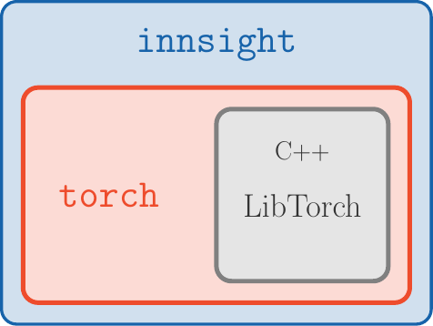

```{r, include = FALSE}
knitr::opts_chunk$set(
  size = "huge",
  collapse = TRUE,
  comment = "#>",
  fig.align = "center",
  out.width = "95%"
)
```
```{css, echo = FALSE}
details {
  padding: 10px 10px;
}

details > summary {
  border: none;
  cursor: pointer;
}

details[open] {
  border-radius: 10px 10px 10px 10px;
  padding: 7px 7px;
  border: 3px solid lightgrey;
}
```
```{r, echo = FALSE}
Sys.setenv(LANG="en_US.UTF-8")
set.seed(1111)
torch::torch_manual_seed(1111)
```

<style>
.column-left{
  float: left;
  width: 70%;
  text-align: left;
}
.column-right{
  float: right;
  width: 30%;
  text-align: right;
}
</style>

<style>
    img {
        border: 0;
    }
</style>

In the last decade, it has been demonstrated in an impressive way how efficiently and successfully neural networks can analyze and understand enormous amounts of data. They can recognize patterns and associations and transfer this knowledge to new data points with remarkable accuracy. Moreover, their flexibility eliminates the feature engineering step that was often necessary before and allows them to work directly with raw data. Nevertheless, these associations and internal findings are hidden somewhere in the black box and it is unclear to the user what the crucial aspects of the prediction were. One way to open the black box is through so-called **feature attribution** methods. These are local methods that, based on a single data point (image, tabular instance,...), assign a relevance of a previously defined output class or node to each input variable. In general, only a normal forward pass and a method-specific backward pass are required, which makes implementation much faster compared to perturbation- or optimization-based methods like LIME or Occlusion. Figure 1 illustrates the basic approach of the feature attribution methods.  
</br>

```{r pressure, echo=FALSE, fig.cap = "**Figure 1:** Feature attribution methods"}
knitr::include_graphics("images/feature_attribution.png")
```

### Why innsight?

<div class = "column-left">
Of course, we are not the first to provide several feature attribution methods for neural networks in one package. For example, there are several such packages for Python, such as [`innvestigate`](https://github.com/albermax/innvestigate/), [`captum`](https://captum.ai/) and [`zennit`](https://github.com/chr5tphr/zennit/). Due to the great and extremely efficient deep learning libraries Keras/TensorFlow and PyTorch, it is only reasonable that these are all Python-exclusive. However, in recent years these libraries have been integrated more and more successfully into the R programming language and we fill this lack for feature attribution methods for neural networks in R with our package **innsight**.
</div>

<div class="column-right">

```{r, echo=FALSE, fig.cap = "**Figure 2:** `innsight`"}

```

</div>

In addition to the availability in R, the package is also outstanding for the following aspects:
   
* **Deep-Learning-Library-agnostic:** To be as flexible as possible and available to a range of users, we do not limit ourselves to models from a particular deep learning library, as is the case with all Python variants. Using the `Converter`, each passed model (from **keras**, **torch** or **neuralnet**) is first converted into a list with all relevant information about the model. Then, a **torch**-model is created from this list, which has the available feature attribution methods pre-implemented for each layer. If our package does not support your favorite library, there is also the option to do the converting step by yourself and pass a list directly.

* **No Python dependency:** In R, there are currently two major deep learning 
libraries, namely **keras**/**tensorflow** and **torch**. However, **keras**/**tensorflow**, accesses the corresponding Python methods via the package **reticulate**. We use the fast and efficient [**torch** package](https://torch.mlverse.org/) for all computations, which runs without Python and directly accesses the C++ variant of PyTorch called LibTorch (see Fig. 2).

* **Unified framework:** It does not matter which model and method you choose, it is always the same three steps that lead to a visual illustration of the results (see the 
[next section](how-to-use) for details):
<div align="center"> model $\xrightarrow{\text{Step 1}}$ `Converter` $\xrightarrow{\text{Step 2}}$ method $\xrightarrow{\text{Step 3}}$ `print` or `boxplot` </div></br>

* **Visualization tools:** Our package **innsight** offers several visualization methods for individual or summarized results regardless of whether it is tabular, 1D signal, 2D image data or a mix of these. Additionally, interactive plots can be created based on the **plotly** package.


## How to use

The following is more of a high-level overview that does not explain all the 
details of the three steps. In case you are looking for a more detailed 
overview of all configuration options, we refer you to the 
[vignette *In-depth Explanation*](https://bips-hb.github.io/innsight/vignette/detailed_overview.html) 
(same as `vignette(package = "innsight")).
The three steps for explaining individual predictions with the provided methods 
are unified in this package and follow a strict scheme. This will hopefully 
allow any user a smooth and easy introduction to the possibilities of 
this package. The steps are:

```{r, eval = FALSE}
# Step 0: Model creation
model = ... # this step is left to the user

# Step 1: Convert the model
converter <- Converter$new(model)

# Step 2: Apply selected method to your data
result <- Method$new(converter, data)

# Step 3: Show and plot the results
get_result(result)  # get the result
plot(result)        # for individual results (local)
boxplot(result)     # for summarized results (global)
```


### Step 1: Model Creation and Converting

The **innsight** package aims to be as flexible as possible and independent of 
any particular deep learning package in which the passed network was learned 
or defined. For this reason, there are several ways in this package to pass 
a neural network to the `Converter` object, but the call is always the same:

```{r, eval = FALSE}
# The 'Converter' object (R6 class)
converter <- Converter$new(model, ...)
```

Except for a **neuralnet** model, no names of inputs or outputs are stored in 
the given model. If no further arguments are set for the `Converter`
instance, default labels are generated for the input (e.g. `'X1'`, `'X2'`, ...) 
and output names (`'Y1'`, `'Y2'`, ... ). In the converter, 
however, there is the possibility with the optional arguments `input_names` 
and `output_names` to pass the names, which will then be used in all results 
and plots created by this object.

#### Usage with torch models

Currently, only models created by `torch::nn_sequential` are accepted. 
However, the most popular standard layers and activation functions are 
available (see [here](https://bips-hb.github.io/innsight/vignette/detailed_overview.html#package-torch) for details).

**Note:**
If you want to create an instance of the class `Converter` with a **torch** 
model that meets the above conditions, you have to specify the shape of the 
inputs with the argument `input_dim`. Because this information is not stored 
in every given **torch** model.

<details>
<summary> **Example** </summary>
```{r, eval = torch::torch_is_installed()}
library(torch)
library(innsight)
torch_manual_seed(123)

# Create model
model <- nn_sequential(
  nn_linear(3, 10),
  nn_relu(),
  nn_linear(10, 2, bias = FALSE),
  nn_softmax(2)
)
# Convert the model
conv_dense <- Converter$new(model, input_dim = c(3))
# Convert model with input and output names
conv_dense_with_names <- 
  Converter$new(model, input_dim = c(3),
                input_names = list(c("Price", "Weight", "Height")),
                output_names = list(c("Buy it!", "Don't buy it!")))
```
</details>

#### Usage with keras models

Models created by `keras_model_sequential` or `keras_model` with the **keras**
package are accepted. Within these functions, the most popular layers and activation
functions are accepted  (see [here](https://bips-hb.github.io/innsight/vignette/detailed_overview.html#package-keras) for details).

<details>
<summary> **Example** </summary>
```{r, eval = keras::is_keras_available() & torch::torch_is_installed()}
library(keras)

# Create model
model <- keras_model_sequential()
model <- model %>%
  layer_conv_2d(4, c(5,4), input_shape = c(10,10,3), activation = "softplus") %>%
  layer_max_pooling_2d(c(2,2), strides = c(1,1)) %>%
  layer_conv_2d(6, c(3,3), activation = "relu", padding = "same") %>%
  layer_max_pooling_2d(c(2,2)) %>%
  layer_conv_2d(4, c(2,2), strides = c(2,1), activation = "relu") %>%
  layer_flatten() %>%
  layer_dense(5, activation = "softmax")

# Convert the model
conv_cnn <- Converter$new(model)
```
</details>

#### Usage with neuralnet models

The usage with nets from the package **neuralnet** is very simple and 
straightforward, because the package offers much fewer options than 
**torch** or **keras**. The only thing to note is that no custom activation 
function can be used. However, the package saves the names of the inputs and 
outputs, which can of course be overwritten with the arguments 
`input_names` and `output_names` when creating the converter object.

<details>
<summary> **Example** </summary>
```{r, eval = torch::torch_is_installed()}
library(neuralnet)
data(iris)

# Create model
model <- neuralnet(Species ~ Petal.Length + Petal.Width, iris, 
                   linear.output = FALSE)

# Convert model
conv_dense <- Converter$new(model)
```
</details>

#### Usage with a model as a named list

If you have not trained your net with **keras**, **torch** or **neuralnet**, 
you can also pass your model as a list, i.e. you write your own wrapper for your 
library. But you have to consider a few points, which are explained in detail 
in the [in-depth vignette](https://bips-hb.github.io/innsight/vignette/detailed_overview.html#model-as-named-list).

<details>
<summary> **Example** </summary>
```{r, eval = torch::torch_is_installed()}
model <- list(
  input_dim = 2,
  input_names = list(c("X1", "Feat2")),
  input_nodes = 1,
  output_nodes = 2,
  layers = list(
    list(type = "Dense", weight = matrix(rnorm(10),5,2), bias = rnorm(5),
         activation_name = "relu", input_layers = 0, output_layers = 2),
    list(type = "Dense", weight = matrix(rnorm(5),1,5), bias = rnorm(1),
         activation_name = "sigmoid", input_layers = 1, output_layers = -1)
  )
)

converter <- Converter$new(model)
```
</details>

### Step 2: Apply selected Method

The **innsight** package provides the several tools for analyzing black box
neural networks based on dense or convolution layers. For the sake of uniform 
usage, all implemented methods inherit from the `InterpretingMethod` 
superclass (see `?InterpretingMethod` for details) and differ in each case 
only by method-specific arguments and settings. Therefore, each method 
has the following initialization structure: 

```{r, eval = FALSE}
method <- Method$new(converter, data,          # required arguments
                     channels_first = TRUE,    # optional settings
                     output_idx = NULL,        # .
                     ignore_last_act = TRUE,   # .
                     ...)                      # other args and method-specific args
```
The most important arguments are explained below. For a complete and detailed 
explanation, however, we refer to the R documentation (see 
`?InterpretingMethod`) or the vignette [In-depth Explanation](https://bips-hb.github.io/innsight/vignette/detailed_overview.html#step-2-apply-selected-method).

* `converter`: This is the converter object created in the [first step](#step-1-model-creation-and-converting).

* `data`: The data to which the method is to be applied. These must have the 
same format as the input data of the passed model to the converter object. 
This means either an `array`, `data.frame`, `torch_tensor` or array-like 
format of size $\left(\text{batchsize}, \text{input_dim}\right)$, if e.g. 
the model has only one input layer, or a `list` of the respective input sizes 
for each of the input layers.

* `channels_first`: The channel position of the given data (argument `data`).
If `TRUE`, the channel axis is placed at the second position between the 
batch size and the rest of the input axes, e.g. `c(10,3,32,32)` for a batch 
of ten images with three channels and a height and width of 32 pixels. 
Otherwise (`FALSE`), the channel axis is at the last position, i.e. 
`c(10,32,32,3)`. If the data has no channel axis, use the default value `TRUE`.

* `output_idx`: These indices specify the output nodes or classes for which 
the method is to be applied. If the model has only one output layer, the 
values correspond to the indices of the output nodes, e.g. `c(1,3,4)` for the 
first, third and fourth output node. If your model has more than one output
layer, you can pass the respective output nodes in a list which is described in
detail in the R documentation (see `?InterpretingMethod`) or [here](https://bips-hb.github.io/innsight/vignette/detailed_overview.html#argument-output_idx)

* `ignore_last_act`: Set this logical value to include the last activation 
functions for each output layer, or not (default: `TRUE`)

The package **innsight** now offers the following methods for interpreting your 
model. To use them, simply replace the name `"Method"` with one of the method's 
names below. There are also method-specific arguments, but these are 
explained in detail along with the methods in the R documentation (e.g. 
`?Gradient` or `?LRP`) or [in-depth vignette](https://bips-hb.github.io/innsight/vignette/detailed_overview.html#methods).
Let $x \in \mathbb{R}^p$ the input instance, $i$ is the feature index of the 
input and $c$ the index of the output node or class to be explained:

<ul>
<li> **`Gradient`** : Calculation of the model output *Gradients* with respect
to the model inputs including the attribution method 
[*Gradient x Input*](https://www.jmlr.org/papers/v11/baehrens10a.html):

$$
\begin{align}
\text{Gradient}(x)_i^c &= \frac{\partial f(x)_c}{\partial x_i}\\ 
\text{Gradient x Input}(x)_i^c &= x_i \cdot \text{Gradient}(x)_i^c
\end{align}
$$
<details>
<summary>Examples</summary>
```{r, results='hide', message=FALSE, eval = keras::is_keras_available() & torch::torch_is_installed()}
# Apply method 'Gradient' for the dense network
grad_dense <- Gradient$new(conv_dense, iris[-c(1,2,5)])

# Apply method 'Gradient x Input' for CNN
x <- torch_randn(c(10,3,10,10))
grad_cnn <- Gradient$new(conv_cnn, x, times_input = TRUE)
```
</details>
</li>

<li> **`SmoothGrad`** : Calculation of the smoothed model output gradients 
([*SmoothGrad*](https://arxiv.org/abs/1706.03825)) with respect to the model
inputs by averaging the gradients over number of inputs with added noise 
(including *SmoothGrad x Input*):
$$
\text{SmoothGrad}(x)_i^c = \mathbb{E}_{\varepsilon \sim \mathcal{N}(0, \sigma^2)}\left[\frac{\partial f(x + \varepsilon)_c}{\partial (x + \varepsilon)_i}\right] \approx \frac{1}{n} \sum_{k=1}^n \frac{\partial f(x + \varepsilon_k)_c}{\partial (x + \varepsilon_k)_i}
$$
with $\varepsilon_1, \ldots \varepsilon_n \sim \mathcal{N}(0, \sigma^2)$.  

<details>
<summary>Examples</summary>
```{r, results='hide', message=FALSE, eval = keras::is_keras_available() & torch::torch_is_installed()}
# Apply method 'SmoothGrad' for the dense network
smooth_dense <- SmoothGrad$new(conv_dense, iris[-c(1,2,5)])

# Apply method 'SmoothGrad x Input' for CNN
x <- torch_randn(c(10,3,10,10))
smooth_cnn <- SmoothGrad$new(conv_cnn, x, times_input = TRUE)
```
</details>
</li>

<li> **`LRP`** : Back-propagating the model output to the model input neurons to 
obtain relevance scores for the model prediction which is known as
[*Layer-wise Relevance Propagation*](https://doi.org/10.1371/journal.pone.0130140):
$$
f(x)_c \approx \sum_{i=1}^d R_i
$$
with $R_i$ relevance score for input neuron $i$.

<details>
<summary>Examples</summary>
```{r, results='hide', message=FALSE, eval = keras::is_keras_available() & torch::torch_is_installed()}
# Apply method 'LRP' for the dense network
lrp_dense <- LRP$new(conv_dense, iris[-c(1,2,5)])

# Apply method 'LRP' for CNN with alpha-beta-rule
x <- torch_randn(c(10,10,10,3))
lrp_cnn <- LRP$new(conv_cnn, x, rule_name = "alpha_beta", rule_param = 1,
                   channels_first = FALSE)
```
</details>
</li>

<li> **`DeepLift`** : Calculation of a decomposition of the model output with
respect to the model inputs and a reference input which is known as
*Deep Learning Important FeaTures* 
([*DeepLift*](https://arxiv.org/abs/1704.02685)):
$$
\Delta y_c = f(x)_c - f(x_\text{ref})_c = \sum_{i=1}^d C_i
$$
with $C_i$ contribution score for input neuron $i$ to the 
difference-from-reference model output $\Delta y_c$.

<details>
<summary>Examples</summary>
```{r, results='hide', message=FALSE, eval = keras::is_keras_available() & torch::torch_is_installed()}
# Define reference value
x_ref <- array(colMeans(iris[-c(1,2,5)]), dim = c(1,2))
# Apply method 'DeepLift' for the dense network
deeplift_dense <- DeepLift$new(conv_dense, iris[-c(1,2,5)], x_ref = x_ref)

# Apply method 'DeepLift' for CNN
x <- torch_randn(c(10,3,10,10))
deeplift_cnn <- DeepLift$new(conv_cnn, x)
```
</details>
</li>

<li> **`ConnectionWeights`** : This is a naive and old approach by calculating 
the product of all weights from an input to an output neuron and then adding
them up (see [*Connection Weights*](https://doi.org/10.1016/j.ecolmodel.2004.03.013)).

<details>
<summary>Examples</summary>
```{r, results='hide', message=FALSE, eval = keras::is_keras_available() & torch::torch_is_installed()}
# Apply global method 'ConnectionWeights' for a dense network
connectweights_dense <- ConnectionWeights$new(conv_dense)

# Apply local method 'ConnectionWeights' for a CNN
# Note: This variant requires input data
x <- torch_randn(c(10,3,10,10))
connectweights_cnn <- ConnectionWeights$new(conv_cnn, x, times_input = TRUE)
```
</details>
</li>
</ul>

#### Notes

* By default, the last activation function is not taken into account 
for all data-based methods. Because often this is the sigmoid/logistic or 
the softmax function, which has increasingly smaller gradients with growing 
distance from 0, which leads to the so-called 
*saturation problem*. But if you still want to consider the last activation 
function, use the argument `ignore_last_act = FALSE`.

* For data with channels, it is not possible to determine exactly on which 
axis the channels are located. Internally, all data and the converted model are 
in the data format *"channels first"*, i.e. directly after the batch dimension 
$\left(\text{batchsize}, \text{channels}, \text{input_dim}\right)$. In case you
want to pass data with *"channels last"* (e.g. for MNIST-data 
$\left(\text{batchsize}, 28,28,3\right)$), 
you have to indicate that with argument `channels_first` in the
applied method.

* It can happen with very large and deep neural networks that the calculation 
for all outputs requires both the entire memory and takes a very long time. 
But often, the results are needed only for certain output nodes. By default, 
only the results for the first 10 outputs are calculated, which can be adjusted
individually with the argument `output_idx` by passing the relevant output
indices.


### Step 3: Show and plot the results

Once a method object has been created, the results can be returned as an 
`array`, `data.frame`, or `torch_tensor`, and can be further processed as 
desired. In addition, for each of the three sizes of the inputs (tabular, 1D 
signals or 
2D) suitable plot and boxplot functions based on 
[ggplot2](https://ggplot2.tidyverse.org/) are implemented. Due to the 
complexity of higher dimensional inputs, these plots and boxplots can also 
be displayed as an interactive [plotly](https://plotly.com/r/) plots by using 
the argument `as_plotly`.

#### Get results

Each instance of the interpretability methods has the class method 
`get_result`, which is used to return the results. You can choose between 
the data formats `array`, `data.frame` or `torch_tensor` by passing the
name as an character for argument `type`. This method is also implemented
as a S3 method. For a deeper view in this method look [here](https://bips-hb.github.io/innsight/vignette/detailed_overview.html#get-results).

```{r, eval = FALSE}
# Get the result with the class method
method$get_result(type = "array")

# or use the S3 function
get_result(method, type = "array")
```

**Examples:**
<details>
<summary> `array` (default) </summary>
```{r, eval = keras::is_keras_available() & torch::torch_is_installed()}
# Get result (make sure 'grad_dense' is defined!)
result_array <- grad_dense$get_result() 

# or with the S3 method
result_array <- get_result(grad_dense) 

# Show for datapoint 1 and 71 the result
result_array[c(1,71),,]
```
</details>

<details>
<summary> `data.frame` </summary>
```{r, eval = keras::is_keras_available() & torch::torch_is_installed()}
# Get result as data.frame (make sure 'lrp_cnn' is defined!)
result_data.frame <- lrp_cnn$get_result("data.frame")

# or with the S3 method
result_data.frame <- get_result(lrp_cnn, "data.frame")

# Show the first 5 rows
head(result_data.frame, 5)
```
</details>

<details>
<summary> `torch_tensor` </summary>
```{r, eval = keras::is_keras_available() & torch::torch_is_installed()}
# Get result (make sure 'deeplift_dense' is defined!)
result_torch <- deeplift_dense$get_result("torch_tensor")

# or with the S3 method
result_torch <- get_result(deeplift_dense, "torch_tensor")

# Show for datapoint 1 and 71 the result
result_torch[c(1,71),,]
```
</details>

#### Plot results

The package **innsight** also provides methods for visualizing the results. 
By default a **ggplot2**-plot is created, but it can also be rendered as an 
interactive **plotly** plot with the `as_plotly` argument. You can use the 
argument `output_idx` to select the indices of the output nodes 
for the plot. In addition, if the results have channels, the 
`aggr_channels` argument can be used to determine how the channels are 
aggregated. All arguments are explained in detail in the R documentation 
(see `?InterpretingMethod`) or [here for `plot`](https://bips-hb.github.io/innsight/vignette/detailed_overview.html#plot-single-results-plot) and 
[here for `boxplot`](https://bips-hb.github.io/innsight/vignette/detailed_overview.html#plot-summarized-results-boxplot).

```{r, eval = FALSE}
# Create a plot for single data points
plot(method, 
     data_idx = 1,              # the data point to be plotted
     output_idx = NULL,         # the indices of the output nodes/classes to be plotted
     aggr_channels = "sum",
     as_plotly = FALSE)         # create an interactive plot

# Create a plot with summarized results
boxplot(method,
        output_idx = NULL,      # the indices of the output nodes/classes to be plotted
        ref_data_idx = NULL,    # the index of an reference data point to be plotted
        aggr_channels = "sum",
        as_plotly = FALSE,      # create an interactive plot
        ...)                    # other arguments
```

**Note:**  
The argument `output_idx` can be either a vector of indices or a list of 
vectors of indices but must be a subset of the indices for which the results were 
calculated, i.e. a subset of the argument `output_idx` passed to the 
respective method previously. By default (`NULL`), the smallest 
index of all calculated output nodes and output layers is used.

**Examples:**
<details>
<summary> `plot` function (`ggplot2`) </summary>
```{r, eval = keras::is_keras_available() & torch::torch_is_installed(), fig.height=6, fig.width=9}
# Plot the result of the first data point (default) for the output classes '1', '2' and '3'
plot(smooth_dense, output_idx = 1:3)
# You can plot several data points at once
plot(smooth_dense, data_idx = c(1,144), output_idx = 1:3)
# Plot result for the first data point and first and fourth output
plot(lrp_cnn, aggr_channels = 'norm', output_idx = c(1,4))
```
</details>
<details>
<summary> `plot` function (`plotly`) </summary>
```{r, eval = FALSE}
# Create a plotly plot for the first output
plot(lrp_cnn, aggr_channels = 'norm', output_idx = c(1), as_plotly = TRUE)
```
```{r, eval=Sys.getenv("RENDER_PLOTLY", unset = 0) == 0, echo = FALSE}
print("Due to the size, this image was not generated in the R vignette! See the innsight webpage for this image: https://bips-hb.github.io/innsight/articles/innsight.html#plot-results")
```
```{r, fig.width = 8, fig.height=4, echo = FALSE, message=FALSE, eval=Sys.getenv("RENDER_PLOTLY", unset = 0) == 1}
# You can do the same with the plotly-based plots
p <- plot(lrp_cnn, aggr_channels = 'norm', output_idx = c(1), as_plotly = TRUE)
plotly::config(print(p))
```
</details>

<details>
<summary> `boxplot` function (`ggplot2`) </summary>
```{r, eval = keras::is_keras_available() & torch::torch_is_installed(), fig.height=6, fig.width=9}
boxplot(smooth_dense, output_idx = 1:2)
# Use no preprocess function (default: abs) and plot a reference data point
boxplot(smooth_dense, output_idx = 1:3, preprocess_FUN = identity,
        ref_data_idx = c(55))
```
</details>

<details>
<summary> `boxplot` function (`plotly`) </summary>
```{r, eval = TRUE, fig.height=6, fig.width=9, eval = FALSE}
boxplot(smooth_dense, output_idx = 1:3, preprocess_FUN = identity,
        ref_data_idx = c(55), as_plotly = TRUE)
```
```{r, eval=Sys.getenv("RENDER_PLOTLY", unset = 0) == 0, echo = FALSE}
print("Due to the size, this image was not generated in the R vignette! See the innsight webpage for this image: https://bips-hb.github.io/innsight/articles/innsight.html#plot-results")
```
```{r, fig.width = 8, fig.height=4, echo = FALSE, message=FALSE, eval=Sys.getenv("RENDER_PLOTLY", unset = 0) == 1}
# You can do the same with the plotly-based plots
p <- boxplot(smooth_dense, output_idx = 1:3, preprocess_FUN = identity,
        ref_data_idx = c(55), as_plotly = TRUE)
plotly::config(print(p))
```

</details>

